# Fast and Precise Certification of Transformers  

Gregory Bonaert ETH Zurich, Switzerland greg@gregbonaert.com  

Dimitar I. Dimitrov ETH Zurich, Switzerland dimitar.iliev.dimitrov@inf.ethz.ch  

Maximilian Baader ETH Zurich, Switzerland mbaader@inf.ethz.ch  

Martin Vechev ETH Zurich, Switzerland martin.vechev@inf.ethz.ch  

# Abstract  

We present DeepT, a novel method for certifying Transformer networks based on abstract interpretation. The key idea behind DeepT is our new Multi-norm Zonotope abstract domain, an extension of the classical Zonotope designed to handle $\ell^{1}$ and $\ell^{2}$ -norm bound perturbations. We introduce all Multi-norm Zonotope abstract transformers necessary to handle these complex networks, including the challenging softmax function and dot product.  

Our evaluation shows that DeepT can certify <mark>average robustness radii that are $28\times$ larger than the state-of-the-art</mark>, while scaling favorably. Further, for the first time, we certify Transformers against <mark>synonym attacks</mark> on long sequences of words, where each word can be replaced by any synonym. DeepT achieves a high certification success rate on sequences of words where enumeration-based verification would take 2 to 3 orders of magnitude more time.  

**CCS Concepts**: • Theory of computation $\rightarrow$ Program verification; Abstraction; $\bullet$ Computing methodologies $\to$ Neural networks.  

**Keywords**: Abstract Interpretation, Robustness Certification, Deep Learning, Adversarial attacks, Transformer Networks  

# ACM Reference Format:  

Gregory Bonaert, Dimitar I. Dimitrov, Maximilian Baader, and Martin Vechev. 2021. Fast and Precise Certification of Transformers. In Proceedings of the 42nd ACM SIGPLAN International Conference on Programming Language Design and Implementation (PLDI ’21), June 20–25, 2021, Virtual, Canada. ACM, New York, NY, USA, 18 pages. https://doi.org/10.1145/3453483.3454056  

# 1 Introduction  

It has been established that neural networks can be tricked into misclassifying images by small, imperceptible changes to the input, called adversarial attacks [52]. Since their discovery, the community has developed many different attacks, including $\ell^{p}$ -norm bound perturbations [18, 36, 52] as well as geometric perturbations like rotations and translations [13, 25, 42]. The existence of adversarial examples has driven the need for methods and tools able to formally verify the robustness of neural networks against these attacks. Early works on $\ell^{p}$ -norm bound certification included [15: $\text{AI}^2$, 56], while later research investigated certification against geometric transformations [3, 14, 39, 44, 50]. While many works focused on certifying networks operating on continuous input spaces such as images, substantially less research exists on the setting of networks with a discrete input space, as in natural language processing (NLP) tasks, where the input is a word sequence. Recently, however, neural networks for NLP tasks were successfully attacked by exchanging words in the input sequence with synonyms [1, 5, 22, 23, 31, 34].  

> **Adversarial attacks in neural network**: From $\ell^{p}$ -norm bound perturbations (geometric transformations) to synonyms exchange. From image to NLP, continuous to discrete.

**Transformer Networks**. A successful recent neural network architecture for NLP is the Transformer network [54]. Since its introduction, these networks have delivered stateof-the-art performance across many NLP tasks [27, 58]. Further, Transformer networks were successfully applied to a wide variety of other tasks including object detection [7], graph classification [32], speech recognition [20], and visual question answering [33]. The core part of a Transformer network is a stack of self-attention layers. <Mark>For NLP tasks, the first layer of this stack is preceded by an embedding layer, mapping words to vectors in an embedding space.</Mark> 

> Success of Transformer in NLP and CV.

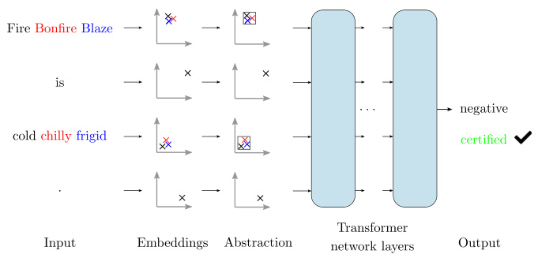  
**Figure 1**. Certification against synonym attacks: input is a sentence (2 of the words each have 2 colored synonyms), the words are embedded; on two of the embeddings we create an abstract region which captures synonyms. Then, our verifier DeepT takes this region and proves that any sentence whose embedding is inside it classifies to a “negative” sentiment.  

**Certification of Transformer Networks**. As the set of words is discrete, to perform certification in the NLP setting, one might try enumeration in order to certify the absence of adversarial examples, by classifying every combination of synonyms. However, while this works well for short sentences consisting of words having few synonyms, enumeration is already infeasible for moderately sized sequences where a few words have many synonyms. A method to circumvent enumeration is to approximate the region of synonym embeddings using an abstract shape. This shape can then be propagated through the network (as standard in neural network verification), as illustrated in Figure 1. In the recent work of [47], a linear relaxation was used to certify Transformer networks against $\ell^{p}$ -norm bound attacks applied to word embeddings for $p\,\in\,\{1,2,\infty\}$ . However, the work of [47] <Mark>does not scale to large Transformer networks</Mark>, with their verifiers having either a dramatically reduced certification ability as the network becomes deeper or becoming impractically slow (superlinear verification time growth). The main challenge in Transformer network verification is creating <Mark>scalable and precise methods to handle the effects of the softmax function and the dot product</Mark>. This is difficult as these functions apply non-linearities on multiple terms under perturbation, simultaneously. Specifically, the challenge for the dot product are the many occurrences of multiplication, while the challenge for the softmax function is the occurrence of the exponential and reciprocal.  

> - The reason utilzing abstract interperation rather than enumerating the combination of synonyms in long sentences.
> - Difficults of dot product and SoftMax in Transformer.

**This Work: Precise Certification of Transformers**. In this work, we address this challenge and present <mark>a verifier called DeepT</mark>, able to certify significantly larger Transformer networks, compared to prior work. <mark>The key idea is a new abstract domain, referred to as the Multi-norm Zonotope</mark>, which improves the precision of the standard Zonotope (that has so far been successfully used for robustness certification of images [49, 55]). Our central contribution is a set of carefully designed abstract transformers that handle critical components of the Transformer architecture, including the challenging self-attention (composed of dot products and softmax functions), balancing scalability and precision.  

We specifically focus on encoder Transformer networks and show that DeepT can certify on average significantly higher robustness radii (up to more than $28\times$ ), particularly of deep Transformer networks, compared to state-of-the-art [47], in comparable time. Further, DeepT can certify robustness against attacks where each word can be replaced by synonyms. For long sentences, DeepT outperforms enumerationbased methods by 2 to 3 orders of magnitude.  

**Main Contributions**. Our main contributions are:  

- The first robustness certification for synonym attacks on Transformer network classification, where each word in long word sequences can potentially be replaced by any synonym, simultaneously. 
- The Multi-norm Zonotope domain together with abstract transformers for all functions occurring in Transformer networks. 
- Carefully constructed abstract transformers for the dot-product and the softmax function, that strike a good balance between precision and performance. 
- A verifier called DeepT based on our abstract transformers, and an extensive experimental evaluation showing DeepT is able to scale certification to significantly larger Transformer networks.

> Contributions:
> - A different perterbation method. (synonyms)
> - A new abstract domain.
> - Proposals to handel dot-product and SoftMax function.
> - Additional experiments. 

# 2 Overview  

We now explain the threat model we are certifying against and how this threat model relates to other threat models. Then, we provide an informal explanation of our method for certifying the robustness of Transformer networks. A detailed explanation is provided in Section 4 and Section 5.  

**Threat Models.** In this work we focus on <mark>binary sentiment classification</mark>, where each input sentence is either positive or negative, a standard NLP classification task.  

In our threat model T1, the adversary can perturb an input sequence by adding $\ell^{p}$ noise $(p\,\in\,\{1,2,\infty\})$ to the embedding of a word. The threat model T2 allows the attacker to exchange every word in the input sequence with a synonym.  

The two threat models are related since a good embedding will map synonyms to points in the embedding space that are close to each other [40]. If we certify robustness for an $\ell^{p}$ - norm bound region around a point in the embedding space, then all words (synonyms) that have their embedding in that region will not change the classification of that sentence. Further, if we have a word we would like to replace, we can certify an $\ell^{p}$ -norm bound ball covering the embeddings of all the replacement words, in order to certify against <mark>attacks as in [1]</mark>. The process is depicted in Figure 1.  

> Task: binary sentiment classification
> 
> Object: Model T1: $\ell^{p}$ - norm
> 
> Model T2: synonyms
>
> In a good embedding, synonyms should in $\ell^{p}$ region.

**Robustness Certification.** Inspired by the success of the Zonotope domain in the context of robustness certification for images [15, 49], we introduce <mark>the Multi-norm Zonotope</mark> in order to certify the robustness of Transformer networks performing binary sequence classification. The Multi-norm Zonotope is an extension of the classical Zonotope domain, containing new noise symbols bounded by an $\ell^{p}$ -norm. This improves certification against $\ell^{p}$ -norm bound attacks.  

We define abstract transformers for the Multi-norm Zonotope domain for all operations in the Transformer network, including affine operations, ReLU, tanh, exponential, reciprocal, dot product and softmax. It is particularly challenging to tightly approximate the dot product and the softmax function, since they may apply multiplications or divisions between two variables under perturbation. Additionally, the quadratic number of interactions between noise symbols leads to a blow-up of the number of noise symbols which slows down computation or even renders it infeasible. To address these issues, we carefully construct the abstract transformers for the softmax and dot product to achieve high precision while maintaining good performance. Further, the number of noise symbols is periodically reduced to lower memory use and improve performance.  

We certify the robustness of a Transformer network by constructing a Multi-norm Zonotope capturing the $\ell^{p}$ region around the embedding of a given input sequence (See Figure 1), which is then propagated through the whole network using our abstract transformers. Thus, we obtain a Multi-norm Zonotope representing an over-approximation of the possible outputs of the Transformer network. Finally, robustness can be certified if the lower bound of $y_{t}\!-\!y_{f}$ is positive where $y_{t}$ is the true class output and $y_{f}$ is the false class output. 

> A new abstract domain called Multi-norm Zonotope.
>
> The carefully abstract transformers for dot-product and SoftMax.
>
> A procedure of the Transformer robustness certification. 

# 3 Background  

In this section, we describe the background needed for the rest of the paper. We first demonstrate the Transformer architecture instantiated to binary sequence classification, after which we explain the Zonotope domain and how Zonotopes are used for neural network verification.  

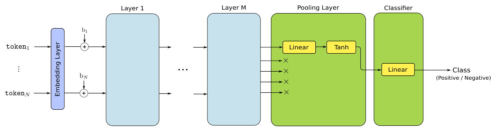  
**Figure 2.** The Transformer network architecture for sequence classification. The tokenized input first gets embedded, to which a positional encoding is added. After $M$ Transformer network layers, pooling follows, which in turn is followed by a classifier.  

## 3.1 Transformer Networks  

In this work, we apply Transformer networks to the task of binary sequence classification, like sentiment prediction. The transformer network takes as input a sequence of tokens (e.g., words) and processes them to get a binary answer (Figure 2). The length of the sequence is variable and is denoted by $N$ .  

A Transformer network first embeds each token $\mathtt{t o k e n}_{j}$ into $\mathbb{R}^{E}$ via a discrete mapping. Then a position embedding $\flat_{j}$ is added, to facilitate the encoding of the location $j$ . This encoded sequence is then passed through $M$ Transformer network layers (Figure 3), after which the encoded sequence passes through a pooling layer followed by a classifier. 

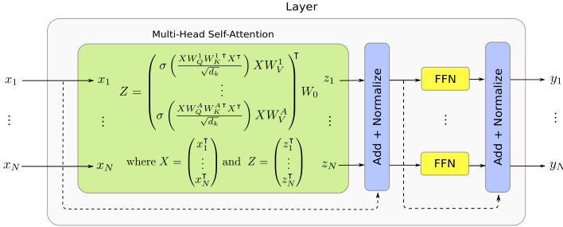  
**Figure 3.** A Transformer layer is composed of a multi-head self-attention and a feed-forward network (FFN). Each component is bypassed by a residual connection (dotted lines) and followed by a normalization layer. 

**Self-Attention.** The key component of a Transformer network layer (Figure 3) is its self-attention mechanism, which processes all sequence elements in conjunction, and thus is able to extract relationships between them.  

The self-attention receives $N$ inputs $\vec{x}_{1},\dots,\vec{x}_{N}\in\mathbb{R}^{E}$ . We transpose and stack them into the matrix $X\in\mathbb{R}^{N\times E}$ to simplify notation. $X$ is then multiplied by 3 separate matrices $W_{Q},W_{K}~\in~\mathbb{R}^{E\times d_{k}}$ and $W_{V}\ \in\ \bar{\mathbb{R}}^{E\times d_{v}}$ to obtain the queries $Q:=X\,W_{Q}$ , the keys $K:=X\,W_{K}$ and the values $V:=X\,W_{V}$ of the embeddings $X$ . The self-attention output $Z$ is then obtained, by computing  

$$
\begin{array}{r}{Z:=\sigma\left(\frac{Q K^{T}}{\sqrt{d_{k}}}\right)V=\sigma\left(\frac{X W_{Q}W_{K}^{T}X^{T}}{\sqrt{d_{k}}}\right)X W_{V},}\end{array}
$$  

where $Z\in\mathbb{R}^{N\times E}$ and the softmax function $\sigma\colon\mathbb{R}^{\mathbb{N}}\mapsto\mathbb{R}^{N}$  

$$
\begin{array}{r}{\sigma_{i}(\nu_{1},\dots,\nu_{N})=\frac{e^{\nu_{i}}}{\sum_{j=1}^{N}e^{\nu_{j}}}}\end{array}
$$  

is applied to every element row by row. Here, $\sigma_{i}$ indicates the $\bar{i}^{\bar{\mathrm{th}}}$ component of $\sigma$ . The rows $\vec{z}_{1},\dotsc\dotsc,\vec{z}_{N}$ of $Z$ are then returned as output embeddings of the self-attention layer.  

We note that the softmax is an integral part of the transformer network itself, contrary to most other neural network architectures where it is only used after the final classification layer to define the training loss.  

**Multi-Head Self-Attention.** Similarly to convolutional neural networks, where multiple convolution filters can be used per layer, multiple self-attentions (called attention heads) can be combined in one layer. If we have $A$ attention heads, each with its own $W_{K},W_{Q}$ and $W_{V}$ matrix, we get $A$ matrices $Z_{a}$ , where $a\,\in\,1,\ldots,A$ . These are horizontally stacked and multiplied from the right with a matrix $W_{0}\,\in\,\mathbb{R}^{(A d_{v})\times E}$ , resulting in a matrix $Z\in\mathbb{R}^{N\times E}$ . As before, rows $\vec{z}_{1},\dotsc\dotsc,\vec{z}_{N}$ of $Z$ are then returned.  

**Residual Connections and Normalization.** The inputs $\vec{x}_{j}$ of each multi-head self-attention layer are added to the corresponding outputs $\vec{z}_{j}$ , thus creating a residual connection [21]. This is followed by a layer normalization step [2] but without the division by the standard deviation. [47] found that not dividing by the standard deviation has no significant impact on the performance, but improves certification rates (see Section 6.6). Thus each vector $\vec{v}_{j}=\vec{x}_{j}+\vec{z}_{j}$ is normalized by mapping it to $\vec{v}_{j}\mathrm{~-~}\text{mean}(\vec{v}_{j})$ . This normalized value is then multiplied by a parameter after which a bias is added.  

**Feed-Forward Network.** The normalization is followed by applying the same feed-forward neural network, mapping $\mathbb{R}^{N}$ to $\mathbb{R}^{N}$ , to each of the $N$ output embeddings. This network consists of one hidden ReLU layer of size $H$ (hidden size). Similarly to the Multi-head self-attention, the feed-forward networks are encapsulated with a residual connection, followed by a normalization layer as described above.  

**Pooling and Classification.** In order for the network to produce a final classification output, after the $M^{\mathrm{th}}$ transformer network layer, we pick its first output embedding and disregard the others (pooling). <mark>The first output embedding is then pushed through a tanh hidden layer</mark>, followed by a binary linear classifier (Figure 2).  

## 3.2 Zonotope Certification  

Our work builds upon the Zonotope abstract domain, which was used to successfully certify neural networks applied to image classification tasks [15, 49].  

**Zonotopes.** A classical Zonotope [16] abstracts a set of $N\in\mathbb{N}$ variables and associates the $k$ -th variable with an affine expression $x_{k}$ using $\mathcal{E}\in\mathbb{N}$ noise symbols defined by  

$$
x_{k}=c_{k}+\sum_{i=1}^{\mathcal{E}}\beta_{k}^{i}\epsilon_{i}=c_{k}+\vec{\beta}_{k}\cdot\vec{\epsilon},
$$  

where $c_{k},\beta_{k}^{i}\,\in\,\mathbb{R}$ and $\epsilon_{i}\;\in\;[-1,1]$ . The value $x_{k}$ can deviate from its center coefficient $c_{k}$ through a series of noise symbols $\epsilon_{i}$ scaled by the coefficients $\beta_{k}^{i}$ . The set of noise symbols $\vec{\epsilon}$ is shared among different variables, thus encoding dependencies between $N$ values abstracted by the zonotope.  

**Affine Abstract Transformer.** All affine arithmetic operations such as sums, subtractions or scalings can be applied directly in the abstract Zonotope domain. Since affine arithmetic is exact, the corresponding abstract transformers are optimal. Given two variables $x_{1}=c_{1}+\vec{\beta}_{1}\cdot\vec{\epsilon}$ and $x_{2}=c_{2}+\overline{{{\beta}}}_{2}\cdot\vec{\epsilon}$ , the abstract transformer for the affine operation $z=a x_{1}+b x_{2}+c$ is  

$$
z=(a c_{1}+b c_{2}+c)+(a\vec{\beta}_{1}+b\vec{\beta}_{2})\cdot\vec{\epsilon}.
$$  

**ReLU Abstract Transformer.** We leverage the minimal area abstract transformer for the ReLU developed in [49], which is applied element-wise. Concretely, the Zonotope abstract transformer for $\mathrm{ReLU}(x)=\text{max}(0,x)$ of the zonotope  

variable $x$ is  

$$
y=\left\lbrace\!\!\begin{array}{l l}{0,}&{\mathrm{if}\,u<0}\\ {x,}&{\mathrm{if}\,l>0}\\ {\lambda x+\mu+\beta_{\mathrm{new}}\,\epsilon_{\mathrm{new}}}&{\mathrm{otherwise},}\end{array}\right.
$$  

where $l$ and $u$ denote the lower and upper bound of $x$ and  

$$
\begin{array}{l}{\lambda=u/(u-l)}\\ {\mu=0.5\text{max}(-\lambda l,(1-\lambda)u)}\\ {\beta_{\mathrm{new}}=0.5\text{max}(-\lambda l,(1-\lambda)u).}\end{array}
$$  

**Certification.** To certify the robustness of a neural network on an input region, we express that region in zonotope form and propagate it through the network using abstract transformers. The resulting output zonotope is an over-approximation of the possible outputs of the network. Given the correct class output $y_{t}$ and the incorrect class output $y_{f}$ , the robustness is proven if the lower bound of $y_{t}-y_{f}$ is positive.  

> traditional method to handle zonotope abstract domain in affine and ReLU abstract transformer.
>
> Something can't understand: $-\lambda l \,\,\,!=\,\,\,(1-\lambda)u$ ?

## 3.3 Dual Norm  

For a given vector $\vec{z}\,\in\,\mathbb R^{N}$ , the dual norm $\|\cdot\|_{p}^{*}$ of the $\ell^{p}$ norm is defined by [43] as:  

$$
\|\vec{z}\|_{p}^{*}=\text{sup}\{\vec{z}\cdot\vec{x}\mid\vec{x}\in\mathbb{R}^{N},\|\vec{x}\|_{p}\leq1\}.
$$  

Further, [43] shows that $\|\cdot\|_{p}^{*}$ is the $\ell^{q}$ norm with $q$ satisfying the relationship $\textstyle{\frac{1}{p}}+{\frac{1}{q}}=1$ .  

Lemma 1. Retain the above notation. The tight lower and upper bounds of $\vec{z}\cdot\vec{x}$ where $\vec{x}\in\mathbb{R}^{N}$ s.t. $\|{\vec{x}}\|_{p}\leq1$ are given by  

$$
l_{k}^{q}=-\|\vec{z}\|_{q}\quad u_{k}^{q}=\|\vec{z}\|_{q}.
$$  

Proof. The proof follows directly from the definition of the dual norm in Equation 3 and the fact that the dual norm of the $\ell^{p}$ norm is the $\ell^{q}$ norm where $\textstyle{\frac{1}{p}}+{\frac{1}{q}}=1$ . The bounds are tight because $\{x\in\mathbb{R}^{N}\mid\|\vec{x}\|_{p}\leq1\}$ is compact and the inner product is continuous, thus the supremum is achieved. 

In the next section, we will leverage Lemma 1 to compute bounds of the variables in our Multi-norm Zonotope domain.  

>这个引理可以用来分析在某种$l^p$范数约束下，一个向量$\vec{x}$与另一个向量$\vec{z}$的内积值的可能范围。

# 4 Multi-Norm Zonotopes  

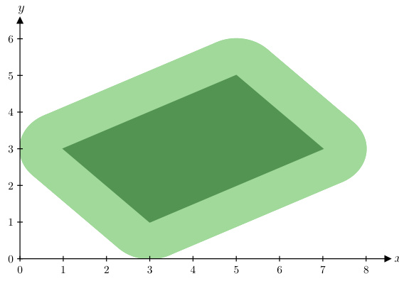  
Figure 4. A Multi-norm zonotope with two variables $x=$ $4\!+\!\phi_{1}\!+\!\phi_{2}\!-\!\epsilon_{1}\!+\!2\epsilon_{2}$ and $y\;=\;3+\phi_{1}+\phi_{2}+\epsilon_{1}+\epsilon_{2}$ where $\|\vec{\phi}\|_{2}\leq1$ and $\epsilon_{1},\epsilon_{2}~\in~[-1,1]$ . The dark green region indicates the classical zonotope obtained by removing the $\vec{\phi}$ noise symbols.  

While $\ell^{\infty}$ perturbations can be naturally expressed with a classical Zonotope, other perturbations such as $\ell^{1}$ or $\ell^{2}$ -norm balls captured by a classical Zonotope would introduce <mark>heavy over-approximation</mark>. To address this, we introduce the Multinorm Zonotope abstract domain, an extension of the classical Zonotope which in addition to the standard noise symbols $\epsilon_{i}$ , contains noise symbols $\phi_{j}$ , fulfilling the constraint $\|\vec{\phi}\|_{p}\leq1$ , where $\vec{\phi}:=(\phi_{1},\ldots,\phi_{\mathcal{E}_{p}})^{T}$ (Figure 4). If $\boldsymbol{p}=\infty$ , we recover the classical Zonotope. This new domain allows to easily express $\ell^{p}$ -norm bound balls in terms of the new noise symbols $\phi$ :  

$$
x_{k}=c_{k}+\sum_{i=1}^{\mathcal{E}_{p}}\alpha_{k}^{i}\phi_{i}+\sum_{j=1}^{\mathcal{E}_{\infty}}\beta_{k}^{j}\epsilon_{j}=c_{k}+\vec{\alpha}_{k}\cdot\vec{\phi}+\vec{\beta}_{k}\cdot\vec{\epsilon},
$$  

$$
c_{k},\alpha_{k}^{i},\beta_{k}^{j}\in\mathbb{R},\quad\|\vec{\phi}\|_{p}\leq1,\quad\epsilon_{j}\in[-1,1],
$$  

where $\mathcal{E}_{p}$ and $\delta_{\infty}$ denote the number of $\ell^{p}$ and $\ell^{\infty}$ noise symbols respectively.  

To concisely represent the $N$ zonotope output variables $x_{1},\ldots,x_{N}$ , we write ${\vec{x}}:=(x_{1},\ldots,x_{N})^{T}$ . Therefore, the Multinorm Zonotope $\vec{x}$ can be simplified to  

$$
\begin{array}{r l r}&{}&{\vec{x}=\vec{c}+A\vec{\phi}+B\vec{\epsilon}}\\ &{}&{\vec{c}\in\mathbb{R}^{N},A\in\mathbb{R}^{N\times\mathcal{E}_{p}},B\in\mathbb{R}^{N\times\mathcal{E}_{\infty}}}\\ &{}&{\|\vec{\phi}\|_{p}\leq1,\quad\epsilon_{j}\in[-1,1],}\end{array}
$$  

where $A_{k,i}=\alpha_{k}^{i}$ and $B_{k,j}=\beta_{k}^{j}$ . In the rest of the section, we describe how to compute the concrete bounds of the Multinorm zonotope and present Multi-norm Zonotope abstract transformers for all operations of the Transformer network (Figures 2 and 3). We extend the existing abstract Zonotope transformers [49] to our Multi-norm Zonotope domain and describe new and efficient abstract transformers for the dot product and the softmax function. To support softmax, we describe the abstract transformers for the exponential and the reciprocal. Further, we prove soundness of our abstract transformers and show that the Relu, Tanh, Exponential and Reciprocal transformers are optimal with respect to the area of the corresponding input-output transformer spaces.  

## 4.1 Computing Concrete Upper and Lower Bounds  

The lower and upper interval bounds of each variable $x_{k}$ of a Multi-norm Zonotope $\vec{x}$ can be obtained by leveraging Lemma 1 to compute the bounds of $\vec{\alpha}_{k}\cdot\vec{\phi}$ :  

$$
\begin{array}{r}{-\|\vec{\alpha}_{k}\|_{q}\leq\vec{\alpha}_{k}\cdot\vec{\phi}\leq\|\vec{\alpha}_{k}\|_{q}.}\end{array}
$$  

Given this, the lower and upper bounds $l_{k}$ and $u_{k}$ of $x_{k}$ are:  

$$
\begin{array}{r}{l_{k}=c_{k}-\|\vec{\alpha}_{k}\|_{q}+\text{min}(\vec{\beta}_{k}\cdot\vec{\epsilon})=c_{k}-\|\vec{\alpha}_{k}\|_{q}-\|\vec{\beta}_{k}\|_{1}}\\ {u_{k}=c_{k}+\|\vec{\alpha}_{k}\|_{q}+\text{max}(\vec{\beta}_{k}\cdot\vec{\epsilon})=c_{k}+\|\vec{\alpha}_{k}\|_{q}+\|\vec{\beta}_{k}\|_{1},}\end{array}
$$  

where we applied Lemma 1 on $\vec{\beta}_{k}$ for the last term.  

**Theorem 1.** *For all $k$ , $l_{k}$ and $u_{k}$ are sound and tight bounds of the Multi-norm Zonotope variable $x_{k}$ .* 

Proof. From the derivation above and the fact that $\vec{\alpha}_{k}\cdot\vec{\phi}$ and $\vec{\beta}_{k}\cdot\vec{\epsilon}$ are independent follows that $l_{k}$ and $u_{k}$ are sound and tight bounds for $x_{k}$ . □  

## 4.2 Affine Abstract Transformer  

The abstract transformer for an affine combination $z=a x_{1}+b x_{2}+c$ of two Multi-norm Zonotope variables $x_{1}=c_{1}+\vec{\alpha}_{1}\cdot\vec{\phi}+\vec{\beta}_{1}\cdot\vec{\epsilon}$ and $x_{2}=c_{2}+\vec{\alpha}_{2}\cdot\vec{\phi}+\vec{\beta}_{2}\cdot\vec{\epsilon}$ , is  

$$
\begin{array}{l}{{z=a x_{1}+b x_{2}+c}}\\ {{\ \ =a(c_{1}+\vec{\alpha}_{1}\cdot\vec{\phi}+\vec{\beta}_{1}\cdot\vec{\epsilon})+b(c_{2}+\vec{\alpha}_{2}\cdot\vec{\phi}+\vec{\beta}_{2}\cdot\vec{\epsilon})+c}}\\ {{\ \ =\left(a c_{1}+b c_{2}+c\right)+\left(a\vec{\alpha}_{1}+b\vec{\alpha}_{2}\right)\cdot\vec{\phi}+\left(a\vec{\beta}_{1}+b\vec{\beta}_{2}\right)\cdot\vec{\epsilon}.}}\end{array}
$$  

Theorem 2. The affine transformer for the Multi-norm Zonotope domain is exact.  

Proof. Follows from the derivation above.  

## 4.3 ReLU Abstract Transformer  

The ReLU abstract transformer defined for the classical Zonotope can be extended naturally to the multi-norm setting since it relies only on the lower and upper bounds of the variables, computed as described in Section 4.1. Concretely, the Multi-norm Zonotope abstract transformer for ${\mathrm{ReLU}}(x)=$ $\text{max}(0,x)$ of the zonotope variable $x$ is  

$$
y=\left\{\!\!\begin{array}{l l}{0,}&{\mathrm{if}\,u<0}\\ {x,}&{\mathrm{if}\,l>0}\\ {\lambda x+\mu+\beta_{\mathrm{new}}\,\epsilon_{\mathrm{new}}}&{\mathrm{otherwise},}\end{array}\right.
$$  

where $\epsilon_{\mathrm{new}}\,\in\,[-1,1]$ denotes a new noise symbol, $l$ and $u$ denote the lower and upper bound of $x$ and  

$$
\begin{array}{l}{\lambda=u/(u-l)}\\ {\mu=0.5\text{max}(-\lambda l,(1-\lambda)u)}\\ {\beta_{\mathrm{new}}=0.5\text{max}(-\lambda l,(1-\lambda)u).}\end{array}
$$  

We note that the newly introduced noise symbol $\epsilon_{\mathrm{new}}$ is an $\ell^{\infty}$ noise symbol. This holds for all $\epsilon_{\mathrm{new}}$ in the following.  

> same with traditional zonotope. It's just how to handel with ReLU, no need to add $\vec{\phi}$

## 4.4 Tanh Abstract Transformer  

To support the tanh function present in the pooling layer (Figure 2), we extend the abstract transformer for the tanh defined in [49], to the multi-norm setting. As for ReLU, the abstract transformer is applied element-wise. The abstract transformer for the operation $y=\text{tanh}(x)$ is  

$$
y=\lambda x+\mu+\beta_{\mathrm{new}}\,\epsilon_{\mathrm{new}},
$$  

where $\epsilon_{\mathrm{new}}\in[-1,1]$ denotes a new noise symbol and  

$$
\begin{array}{r}{\lambda=\text{min}(1-\text{tanh}^{2}(l),1-\text{tanh}^{2}(u))}\\ {\mu=\frac{1}{2}(\text{tanh}(u)+\text{tanh}(l)-\lambda(u+l))}\\ {\beta_{\mathrm{new}}=\frac{1}{2}(\text{tanh}(u)-\text{tanh}(l)-\lambda(u-l)).}\end{array}
$$  

## 4.5 Exponential Abstract Transformer  

Since the softmax function $\sigma$ requires the exponential, we rely on the framework setup in [41] to define the abstract transformer for the exponential function that minimizes the area of the output zonotope and ensures its lower bound is positive, which is required by the reciprocal abstract transformer that will be applied afterward. As described in the paper, the operation $y\,=\,e^{x}$ can be modeled through the element-wise abstract transformer  

$$
y=\lambda x+\mu+\beta_{\mathrm{new}}\,\epsilon_{\mathrm{new}},
$$  

where $\epsilon_{\mathrm{new}}\in[-1,1]$ denotes a new noise symbol,  

$$
\begin{array}{r}{\lambda=e^{t_{\mathrm{opt}}}\qquad\qquad}\\ {\mu=0.5(e^{t_{\mathrm{opt}}}-\lambda t_{\mathrm{opt}}+e^{u}-\lambda u)}\\ {\beta_{\mathrm{new}}=0.5(\lambda t_{\mathrm{opt}}-e^{t_{\mathrm{opt}}}+e^{u}-\lambda u)}\end{array}
$$  

and  

$$
\begin{array}{r l}&{t_{\mathrm{opt}}=\text{min}(t_{\mathrm{crit}},t_{\mathrm{crit},2})}\\ &{t_{\mathrm{crit}}=\log(\frac{e^{u}-e^{l}}{u-l})}\\ &{t_{\mathrm{crit},2}=l+1-\hat{\epsilon}.}\end{array}
$$  

Here, $\hat{\epsilon}$ is a small positive constant value, such as 0.01. The choice $t_{\mathrm{opt}}=\text{min}(t_{\mathrm{crit}},t_{\mathrm{crit,2}})$ ensures that $y$ is positive.  

## 4.6 Reciprocal Abstract Transformer  

To obtain the minimal area abstract transformer for the reciprocal function, which is required for the softmax, we instantiate the equations specified in [41] for that particular function. We note that the algorithm is applicable because the reciprocal function is convex for positive inputs and we are only required to define our transformer for positive inputs due to the softmax structure. The abstract transformer for $\begin{array}{r}{y=\frac{1}{x}}\end{array}$ with $x>0$ is given by  

$$
y=\lambda x+\mu+\beta_{\mathrm{new}}\,\epsilon_{\mathrm{new}},
$$  

where $\epsilon_{\mathrm{new}}\in[-1,1]$ denotes a new noise symbol and  

$$
\begin{array}{l}{\lambda=-\frac{1}{t_{\mathrm{opt}}^{2}}}\\ {\mu=0.5(\frac{1}{t_{\mathrm{opt}}}-\lambda\cdot t_{\mathrm{opt}}+\frac{1}{l}-\lambda l)}\\ {\beta_{\mathrm{new}}=0.5(\lambda\cdot t_{\mathrm{opt}}-\frac{1}{t_{\mathrm{opt}}}+\frac{1}{l}-\lambda l)}\end{array}
$$  

and  

$$
\begin{array}{r l}&{t_{\mathrm{opt}}=\text{min}(t_{\mathrm{crit}},t_{\mathrm{crit},2})}\\ &{t_{\mathrm{crit}}=\sqrt{u l}}\\ &{t_{\mathrm{crit},2}=0.5u+\hat{\epsilon}.}\end{array}
$$  

Similarly to the exponential transformer, $\hat{\epsilon}$ is a small positive constant and $t_{\mathrm{opt}}=\text{min}(t_{\mathrm{crit}},t_{\mathrm{crit,2}})$ ensures that $y$ is positive.  

## 4.7 Soundness and Precision of the Elementwise Abstract Transformers  

Theorem 3. The Multi-norm Zonotope abstract transformers for ReLU, tanh, exponential and reciprocal are sound and optimal in terms of their area in input-output space.  

Proof. As outlined in Section 4.3-4.6, all of our elementwise abstract transformers follow the functional form of their classical Zonotope counterparts. In [41, 49] the classical Zonotope transformers are applied elementwise and map a Zonotope variable $x$ to an affine combination $y=\lambda x\!+\!\mu\!+\!\beta_{\mathrm{new}}\epsilon_{\mathrm{new}},$ where $\epsilon_{\mathrm{new}}$ is a new $\ell^{\infty}$ noise symbol. They prove that their choices for $\lambda,\mu$ and $\beta_{\mathrm{new}}$ provide a sound overapproximation and are optimal in terms of the area in the input-output space. Further, $\lambda,\mu$ and $\beta_{\mathrm{new}}$ depend only on the interval bounds $l$ and $u$ of $x$ and the underlying function. Their proofs rely only on the exactness of the affine abstract transformer and the precision and soundness of $l$ and $u$ .  

Our Multi-norm Zonotope transformers use the same functional form for the Multi-norm Zonotope output variable $y=\lambda x+\mu+\beta_{\mathrm{new}}\epsilon_{\mathrm{new}}$ , where as before $\epsilon_{\mathrm{new}}$ is a new $\ell^{\infty}$ noise symbol. Further, for our Multi-norm Zonotopes, the bounds $l$ and $u$ are also sound and precise (Theorem 1) and the affine transformer is also exact (Theorem 2). Since $\lambda,\mu$ and $\beta_{\mathrm{new}}$ depend only on the bounds $l$ and $u$ and the underlying function, the proofs in [41, 49] transfer directly to our setting. Thus, our abstract transformers are also sound and optimal in terms of the area in input-output space. □  

## 4.8 Dot Product Abstract Transformer  

Next, we define the abstract transformer for the dot product between pairs of vectors of variables of a Multi-norm Zonotope. The transformer is used in the multi-head self-attention, more specifically in the matrix multiplications between $\boldsymbol{Q}$ and $K$ and between the result of the softmax and $V$ (Figure  
3). Note that the dot product transformer is required here because both operands of our matrix multiplications are represented as a part of the zonotope. This is in contrast to the matrix multiplications we have in an affine layer for example, where only one of the matrices is part of the zonotope.  
The standard dot product for two vectors $\vec{v}_{1},\vec{v}_{2}\in\mathbb{R}^{N}$ is given by $y = \vec{v_1}\cdot\vec{v_2}=\sum_{k=1}^{N}{v_1^k v_2^k}$. Computing the dot product between two Multi-norm Zonotope vectors sharing error terms $\vec{v_{1}}=\vec{c}_{1}+A_{1}\vec{\phi}+B_{1}\vec{\epsilon}$ and $\vec{v}_{2}=\overline{{{c}}}_{2}+A_{2}\vec{\phi}+B_{2}\vec{\epsilon}$ produces the output variable $y$ :  

$$
\begin{array}{r l}&{y=\vec{v_{1}}\cdot\vec{v_{2}}=(\vec{c}_{1}+A_{1}\vec{\phi}+B_{1}\vec{\epsilon})\cdot(\vec{c}_{2}+A_{2}\vec{\phi}+B_{2}\vec{\epsilon})}\\ &{\quad=\vec{c}_{1}\cdot\vec{c}_{2}+(\vec{c}_{1}^{\top}A_{2}+\vec{c}_{2}^{\top}A_{1})\vec{\phi}+(\vec{c}_{1}^{\top}B_{2}+\vec{c}_{2}^{\top}B_{1}^{\top})\vec{\epsilon}}\\ &{\quad+\,(A_{1}\vec{\phi}+B_{1}\vec{\epsilon})\cdot(A_{2}\vec{\phi}+B_{2}\vec{\epsilon}).}\end{array}
$$  

> 第一项是准确的，无需上下界。二三项是有范围的，上下界是系数的对偶范数（dual norm）。因此只需要确定最后一项的范围。

Next, we focus on <mark>the last term of this expression</mark>, representing interaction between noise symbols, as this term is not in the functional form of a Multi-norm Zonotope. We first expand the last term and get  

$$
\begin{array}{r}{(A_{1}\vec{\phi}+B_{1}\vec{\epsilon})\cdot(A_{2}\vec{\phi}+B_{2}\vec{\epsilon})=(A_{1}\vec{\phi})\cdot(A_{2}\vec{\phi})+(A_{1}\vec{\phi})\cdot(B_{2}\vec{\epsilon})}\\ {+\ (B_{1}\vec{\epsilon})\cdot(A_{2}\vec{\phi})+(B_{1}\vec{\epsilon})\cdot(B_{2}\vec{\epsilon}).}\end{array}
$$  

Each of the 4 cases contains a different combination of noise symbols and coefficients. We calculate interval bounds for each of the combinations, e.g., $[l_{\phi,\epsilon},u_{\phi,\epsilon}]$ for $(A_{1}\vec{\phi})\cdot(B_{2}\vec{\epsilon})$ . Then the sum of the lower and upper bounds,  

$$
\begin{array}{l}{{l=l_{\phi,\phi}+l_{\phi,\epsilon}+l_{\epsilon,\phi}+l_{\epsilon,\epsilon}}}\\ {{u=u_{\phi,\phi}+u_{\phi,\epsilon}+u_{\epsilon,\phi}+u_{\epsilon,\epsilon},}}\end{array}
$$  

binds the whole term $l\leq\big(A_{1}\vec{\phi}+B_{1}\vec{\epsilon}\big)\cdot\big(A_{2}\vec{\phi}+B_{2}\vec{\epsilon}\big)\leq u.$  

Next, we show a general method to compute the interval bounds for each of the 4 cases. For the $\epsilon{,}\epsilon{-}\mathrm{case}$ , we additionally present a second variant for the computation which is slower but more precise.  

**Fast Bounds $l_{\gamma,\delta},\,u_{\gamma,\delta}$ (DeepT-Fast).** To showcase the method, we calculate interval bounds for the generic expression $(V\vec{\xi}_{p_{1}})\cdot(W\vec{\xi}_{p_{2}})$ , where $V$ and $W$ are matrices such that $V\vec{\xi}_{p_{1}}$ and $W_{5p_{2}}^{\vec{\xi}}$ have the same dimension and $\|\vec{\xi}_{p_{1}}\|_{p_{1}}\leq\,1$ and $\|\vec{\xi}_{p_{2}}\|_{p_{2}}\leq1$ . We do this by computing an upper bound for the absolute value  

$$
|(V\vec{\xi}_{p_{1}})\cdot(W\vec{\xi}_{p_{2}})|=|\vec{\xi}_{p_{1}}^{T}V^{T}W\vec{\xi}_{p_{2}}|\leq|\vec{\xi}_{p_{1}}^{T}V^{T}||W\vec{\xi}_{p_{2}}|,
$$  

where $\big|\cdot\big|$ denotes either the absolute value for scalars or the elementwise absolute value for vectors or matrices. Here, we used the triangle inequality in the last step.  

We use Lemma 1 to bind the elements $|\vec{w}_{j}\cdot\vec{\xi}_{p_{2}}|$ of the vector $|W\vec{\xi}_{p_{2}}|$ , where $\vec{w}_{j}$ denotes the $j^{\mathrm{th}}$ row of $W$ and $\ell^{q_{2}}$ is the dual norm of $\ell^{p_{2}}$ . We obtain  

$$
\begin{aligned}
&\left| \left( V_{\xi_{p_{1}}}^{\vec{\xi}} \right) \cdot \left( W_{\xi_{p_{2}}}^{\vec{\xi}} \right) \right| \leq 
\left| \vec{\xi}_{p_{1}}^{T} V^{T} \right| 
\begin{pmatrix}
\left| \vec{w}_{1} \cdot \vec{\xi}_{p_{2}} \right| \\ 
\vdots \\ 
\left| \vec{w}_{N} \cdot \vec{\xi}_{p_{2}} \right|
\end{pmatrix}
\leq 
\left| \vec{\xi}_{p_{1}}^{T} V^{T} \right| 
\begin{pmatrix}
\|\vec{w}_{1}\|_{q_{2}} \\ 
\vdots \\ 
\|\vec{w}_{N}\|_{q_{2}}
\end{pmatrix}.
\end{aligned}
$$  

We further bind the last term in the inequality  

$$
|\vec{\xi}_{p_{1}}^{T}V^{T}|\left(\begin{array}{l}{\Vert\vec{w}_{1}\Vert_{q_{2}}}\\ {\vdots}\\ {\Vert\vec{w}_{N}^{\,\cdot}\Vert_{q_{2}}}\end{array}\right)=\left(\begin{array}{l}{\Vert\vec{w}_{1}\Vert_{q_{2}}}\\ {\vdots}\\ {\Vert\vec{w}_{N}^{\,\cdot}\Vert_{q_{2}}}\end{array}\right)^{T}\lvert V\vec{\xi}_{p_{1}}\rvert\leq\left(\begin{array}{l}{\Vert\vec{w}_{1}\Vert_{q_{2}}}\\ {\vdots}\\ {\Vert\vec{w}_{N}^{\,\cdot}\Vert_{q_{2}}}\end{array}\right)^{T}\lvert V\rvert\lvert\vec{\xi}_{p_{1}}\rvert.
$$  

As before, we can use Lemma 1 to bind the rem aining expression, which leaves us with  

$$
|(V\vec{\xi}_{p_{1}})\cdot(W\vec{\xi}_{p_{2}})|\leq\left\|\left(\begin{array}{c}{||\vec{w}_{1}||_{q_{2}}}\\ {\vdots}\\ {||\vec{w}_{N}^{\,}||_{q_{2}}}\end{array}\right)^{T}|V|\right\|_{q_{1}},
$$  

where $\ell^{q_{1}}$ is the dual norm of $\ell^{p_{1}}$  

The complexity to compute this bound is $O(N(\mathcal{E}_{p}+\mathcal{E}_{\infty}))$ . As the final bound is not symmetric in $W$ and $V$ , a natural question arises, whether it is better to apply the dual norm trick the other way round. Our experiments show, neither order is strictly better than the other, but on average it is advantageous to apply the dual norm trick first on the $\ell^{\infty}$ -norm terms and then on the $\ell^{p}$ -norm terms (see section 6.5).  

**Theorem 4.** The Fast variant of dot-product abstract transformers of the Multi-norm Zonotope is sound.  

*Proof.* The derivation of Equation 5 above demonstrates that the computed bound is indeed a sound upper bound of $\vec{v}_{1}\cdot\vec{v}_{2}$ , the derivation for the lower bound is analogous. □  

**More Precise Bounds $l_{\epsilon,\epsilon}$ , $u_{\epsilon,\epsilon}$ (DeepT-Precise).** In the case where our Multi-norm Zonotope has solely $\ell^{\infty}$ noise symbols $(p_{1}\,=\,p_{2}\,=\,\infty)$ ), that is 𝑝1 = 𝜉 𝑝2 = 𝜖 , a tighter approximation using interval analysis can be achieved at the cost of increasing the computational complexity to $O(N{\mathcal{E}_{\infty}}^{2})$ using a method inspired by [19]. We begin by summing coefficients related to each pair of noise symbols.  

$$
(V\vec{\epsilon})\cdot(W\vec{\epsilon})=\sum_{i=1}^{\mathcal{E}_{\infty}}\sum_{j=1}^{\mathcal{E}_{\infty}}(\vec{v}_{i}\cdot\vec{w}_{j})\epsilon_{i}\epsilon_{j},
$$  

where $\vec{v}_{i}$ and $\vec{w}_{j}$ denote the $i^{\mathrm{th}}$ and $j^{\mathrm{th}}$ column of $V$ and $W$ respectively. We separate $\epsilon_{i}^{2}$ and $\epsilon_{i}\epsilon_{j}$ to arrive at  

$$
(V\vec{\epsilon})\cdot(W\vec{\epsilon})=\sum_{i=1}^{\mathcal{E}_{\infty}}(\vec{v}_{i}\cdot\vec{w}_{i})\epsilon_{i}^{2}+\sum_{i\neq j}(\vec{v}_{i}\cdot\vec{w}_{j})\epsilon_{i}\epsilon_{j}.
$$  

We know that $\epsilon_{i}^{2}\in[0,1]$ and $\epsilon_{i}\epsilon_{j}\in[-1,1]$ , hence  

$$
(V\vec{\epsilon})\cdot(W\vec{\epsilon})\in\sum_{i=1}^{\mathcal{E}_{\infty}}(\vec{v}_{i}\cdot\vec{w}_{i})\big[0,1\big]+\sum_{i\neq j}^{\mathcal{E}_{\infty}}(\vec{v}_{i}\cdot\vec{w}_{j})\big[-1,1\big].
$$  

Using simple interval analysis, we can now calculate the lower and upper interval bounds $l_{\epsilon,\epsilon}$ and $u_{\epsilon,\epsilon}$ .  

Theorem 5. The Precise variant of dot-product abstract transformers of the Multi-norm Zonotope is sound.  

Proof. The derivation of Equation 6 shows that $l_{\epsilon,\epsilon}$ and $u_{\epsilon,\epsilon}$ are indeed sound bounds of $\vec{v}_{1}\cdot\vec{v}_{2}$ . □  

We note that DeepT-Fast and DeepT-Precise can be combined: DeepT-Fast can be used to compute the bounds for the mixed terms $(l_{\phi,\phi},u_{\phi,\phi})$ , $(l_{\phi,\epsilon},u_{\phi,\epsilon})$ and $(l_{\epsilon,\phi},u_{\epsilon,\phi})$ , while DeepT-Precise can be used to compute $(l_{\epsilon,\epsilon},u_{\epsilon,\epsilon})$ . We leave empirical evaluation of this variant for future work.  

## 4.9 Multiplication Abstract Transformer  

The multiplication abstract transformer is a special case of the dot-product abstract transformer where the vectors have only one element.  

# 5 Practical Robustness Certification  

While our Multi-norm Zonotope transformers described so far could be directly implemented and applied in a straight forward manner, this would not scale to larger networks, and the accumulated overapproximation would reduce overall verification precision. In this section we introduce several techniques that improve the scalability and precision of our abstract transformers, enhancing their practical effectiveness: In Section 5.1, we improve performance and lower memory usage by periodically reducing the number of noise symbols, in Section 5.2, we reduce the loss of precision that occurs during softmax by using an alternative but equivalent softmax definition whose abstract transformer is more precise, and in Section 5.3 we improve precision by introducing the constraint that softmax output values need to sum to 1, ensuring the output variables form a normalized distribution. Finally, in Section 5.4, we discuss the differences between DeepT and the related work.  

## 5.1 Noise Symbol Reduction  

Through the repeated application of abstract transformers during verification, the number of $\ell^{\infty}$ noise symbols grows, leading to slower verification and higher memory usage. In fact, every abstract transformer we use, except the one for affine transformations, can yield new noise symbols $\epsilon_{\mathrm{new}}$ . To address this, we periodically reduce the number of $\ell^{\infty}$ noise symbols to ensure an upper bound on the memory usage independent of the network depth, thus creating a tunable tradeoff between precision and speed.  

DecorrelateM $\mathbf{\Delta}_{h_{k}}$ [38]. A heuristic method that reduces the number of $\ell^{\infty}$ noise symbols in a classical Zonotope to $k$ is Decorrelate ${\mathrm{Min}}_{k}$ . We follow and apply that method to our Multi-norm Zonotope setting by calculating a heuristic score $\begin{array}{r}{m_{j}=\sum_{i=1}^{N}|B_{i,j}|}\end{array}$ for every $\ell^{\infty}$ noise symbol $\epsilon_{j}$ and keeping the top $k\,\ell^{\infty}$ noise symbols.  

Let $I$ denote the indices of the eliminated $\ell^{\infty}$ noise symbols and $P$ the indices of the top $k\,\ell^{\infty}$ noise symbols. Then, the new Multi-norm Zonotope is:  

$$
\vec{x}=\vec{c}+A\vec{\phi}+B_{P}\,\vec{\epsilon}_{P}+\left(\begin{array}{c}{\epsilon_{\mathrm{new,1}}\sum_{i\in I}|\beta_{1,i}|}\\ {\vdots}\\ {\epsilon_{\mathrm{new,}N}\sum_{i\in I}^{}|\beta_{N,i}|}\end{array}\right),\ \ \vec{\epsilon}_{\mathrm{new}}\in\left[-1,1\right]^{N}.
$$  

The Transformer network has residual connections in each Transfomer layer, each combining two different branches of the neural network. Noise symbol reduction is applied to the input embeddings of every Transformer layer, just before the residual connection around the multi-head selfattention, avoiding the complexities of handling separate noise reductions in two branches.  

## 5.2 Softmax Abstract Transformer  

The softmax function $\sigma$ is a key operation in the self-attention (Figure 3). While the transformers for exponential, sum, reciprocal and multiplication can be used to construct a transformer for the softmax directly, we rewrite the softmax to:  

$$
\sigma_{i}(\nu_{1},...,\nu_{N})=\frac{e^{\nu_{i}}}{\sum_{j=1}^{N}e^{\nu_{j}}}=\frac{1}{\sum_{j=1}^{N}e^{\nu_{j}-\nu_{i}}}.
$$  

It is well known that the latter formula is a more numerically stable way of computing the softmax function. We find it is also beneficial for defining our abstract transformers: First, the noise symbols in $\nu_{i}$ can cancel with the ones in $\nu_{j}$ , which reduces the overapproximation introduced through the abstract transformer for the exponential function (it gets worse the larger the inputs are). Second, we do not need the multiplication abstract transformer. Further, this method ensures that the output is always between 0 and 1, as the denominator is always positive and greater than 1.  

## 5.3 Softmax Sum Zonotope Refinement  

By construction, the outputs $y_{1},\dots,y_{N}$ of the softmax function $\sigma$ when applied to inputs $x_{1},\ldots,x_{N}$ satisfy $\textstyle\sum_{i=1}^{N}y_{i}=1$ , i.e. they form a probability distribution. Thus, in the multihead self-attention, the role of the softmax is to pick some convex combination of the values $V$ , according to the similarity between the query and the keys.  

However, this property is not always satisfied for the Multinorm Zonotope obtained for $Z$ produced by the softmax abstract transformer (Eq. 1). By abuse of notation, we call this Zonotope $Z$ . There are many valid instantiations of the noise symbols such that the Zonotope variables do not sum to 1, causing non convex combinations of values to be picked. To address this, we enforce the constraint that the variables must sum to 1, to enforce that a convex combination is selected and to preserve the semantics of the network in our abstract domain. This is achieved by excluding from the Multi-norm Zonotope $Z$ all invalid instantiations of values, obtaining a refined Multi-norm Zonotope $Z^{\prime}$ with lower volume, that helps to increase verification precision.  

We leverage Zonotope constraint methods [17], which produce refined Zonotopes given some equality constraints. A three step process is used to refine all Zonotope variables $y_{1},\dots,y_{N}$ by:  

1. computing a refined variable $y_{1}^{\prime}$ by imposing the equality constraint $y_{1}=1-\left(y_{2}+\cdot\cdot\cdot+y_{N}\right)$ , 2. refining all other variables $y_{2},\dots,y_{N}$ to $y_{2}^{\prime},\dots,y_{N}^{\prime}$ ,  

2. tightening the bounds of the $\epsilon_{i}$ ’s to a subset of $[-1,1]$ . Note that we arbitrarily select $y_{1}$ as the variable to be refined first, but any other variable could have been chosen.  

We now detail these three steps that lead to a refined Zonotope $Z^{\prime}$ with variables $y_{1}^{\prime},\ldots,y_{n}^{\prime}$ that always sum to 1 and have tighter error bounds.  

Step 1. Refining $y_{1}$ . We illustrate the process of obtaining a refined Zonotope with variable $z_{1}^{\prime}$ , given the equality constraint $z_{1}=z_{2}$ for a Zonotope with two variables $z_{1}$ and $z_{2}$ . The final result can then be obtained by instantiating $z_{2}=1-\left(y_{2}+\ldots+y_{N}\right)$ and $z_{1}=y_{1}$ and finally $y_{1}^{\prime}=z_{1}^{\prime}$ .  

While we know that $z_{1}=z_{2}$ needs to hold, not all instantiations of the noise symbols satisfy this constraint. We can compute a new Multi-norm Zonotope variable $z_{1}^{\prime}=c^{\prime}\!+\!\vec{\alpha}^{\prime}\!\cdot\!\vec{\phi}\!+\!\vec{\beta}^{\prime}\!\cdot\!\vec{\epsilon},$ such that for all instantiations of noise symbols of $z_{1}^{\prime}$ , we have $z_{1}\,=\,z_{2}$ and $z_{1}\,=\,z_{1}^{\prime}$ , thereby enforcing the equality constraints $z_{1}=z_{2}$ . We have  

$$
z_{1}:=c_{1}+\vec{\alpha}_{1}\cdot\vec{\phi}+\vec{\beta}_{1}\cdot\vec{\epsilon}=c_{2}+\vec{\alpha}_{2}\cdot\vec{\phi}+\vec{\beta}_{2}\cdot\vec{\epsilon}=:z_{2}.
$$  

If we solve for $\epsilon_{k}$ (any $k$ s.t. $\beta_{k}^{1}-\beta_{k}^{2}\,\neq\,0$ works) in the equation above and substitute it in the equation $z_{2}=z_{1}^{\prime}$ , we obtain the following constraints for the coefficients of $z_{1}^{\prime}$ ,  

$$
\begin{array}{r}{c^{\prime}=c_{2}+(c_{2}-c_{1})\frac{\beta_{k}^{\prime}-\beta_{k}^{2}}{\beta_{k}^{2}-\beta_{k}^{1}}}\\ {\vec{\alpha}^{\prime}=\vec{\alpha}_{2}+(\vec{\alpha}_{2}-\vec{\alpha}_{1})\frac{\beta_{k}^{\prime}-\beta_{k}^{2}}{\beta_{k}^{2}-\beta_{k}^{1}}}\\ {\vec{\beta}^{\prime I}=\vec{\beta}_{2}^{I}+(\vec{\beta}_{2}^{I}-\vec{\beta}_{1}^{I})\frac{\beta_{k}^{\prime}-\beta_{k}^{2}}{\beta_{k}^{2}-\beta_{k}^{1}},}\end{array}
$$  

where $I$ are the indices of the other $\epsilon$ terms (i.e. without $\epsilon_{k}$ ).  

Choosing a Value for $\beta_{k}^{\prime}$ . In the equations above, we have one degree of freedom, namely $\beta_{k}^{\prime}$ . Any value $v$ for $\beta_{k}^{\prime}$ is valid and leads to a valid affine expression $z_{v}^{\prime}$ , with the other coefficients of $z_{v}^{\prime}$ being deduced through the equations above.  

To select $v$ , we opt to minimize the absolute value of the noise symbol coefficients, which acts as a heuristic for the tightness of the zonotope variable:  

$$
v^{*}=\text{min}_{v}S=\text{min}_{v}\left[\|{\vec{\alpha}}^{\prime}\|_{1}+\|{\vec{\beta}}^{\prime}\|_{1}\right].
$$  

The minimization problem above can be efficiently solved with $O((\mathcal{E}_{p}\!+\!\mathcal{E}_{\infty})\log(\mathcal{E}_{p}\!+\!\mathcal{E}_{\infty}))$ complexity, using a method from [17] described in Appendix A.1. We note that to maintain precision, we disallow solutions that lead to the elimination of one of the $\ell^{p}$ -norm noise symbols $\phi$ .  

Step 2. Refining $y_{2},\dots,y_{n}$ . We substitute the expression for $\epsilon_{k}$ computed in Step 1 in the affine expressions of the variables $y_{2},\dots,y_{N}$ , to obtain the refined Multi-norm Zonotope variables $y_{2}^{\prime},\dots,y_{N}^{\prime}$ .  

Step 3. Tightening the Bounds of $\vec{\epsilon}.$ . The refined sum constraint $\begin{array}{r}{S\,=\,1\,-\,\sum_{i=1}^{N}y_{i}^{\prime}\,=\,c_{S}+{\vec{\alpha}}_{S}\cdot{\vec{\phi}}+{\vec{\beta}}_{S}\cdot{\vec{\epsilon}}\,=\,0}\end{array}$ can be further leveraged to tighten the bounds of the $\ell^{\infty}$ noise symbols $\vec{\epsilon}$ , with non zero coefficient, by solving for $\epsilon_{m}$ :  

$$
\begin{array}{r}{\epsilon_{m}=\frac{1}{\beta_{S}^{m}}\left(c_{S}+\vec{\alpha}_{S}\cdot\vec{\phi}+\vec{\beta}_{S}^{I}\cdot\vec{\epsilon}^{I}\right),}\end{array}
$$  

which implies that the range of $\epsilon_{m}$ is restricted to $[a_{m},b_{m}]\cap$ $[-1,1]$ where  

$$
\begin{array}{r l}&{{a_{m}}=\frac{1}{|\beta_{S}^{m}|}\left(c_{S}-\|\vec{\alpha}_{S}\|_{q}-\|\vec{\beta}_{S}\|_{1}\right),}\\ &{{b_{m}}=\frac{1}{|\beta_{S}^{m}|}\left(c_{S}+\|\vec{\alpha}_{S}\|_{q}+\|\vec{\beta}_{S}\|_{1}\right),}\end{array}
$$  

Note that because the noise symbol reduction process assumes all noise symbols $\vec{\epsilon}$ have range $[-1,1]$ , prior to it a pre-processing step occurs where all noise symbols $\epsilon_{m}$ with tightened bounds $[a_{m},b_{m}]\subset[-1,1]$ are re-written as $\begin{array}{r}{\epsilon_{m}=\frac{\bar{a_{m}}+b_{m}}{2}+\frac{b_{m}-a_{m}}{2}\epsilon_{\mathrm{new},m}}\end{array}$ 𝑏𝑚−2𝑎𝑚𝜖new,𝑚with 𝜖new,𝑚∈[−1, 1].  

## 5.4 Discussion  

Next, we discuss the differences between DeepT-Fast and DeepT-Precise with CROWN-BaF and CROWN-Backward from [47], respectively.  

CROWN-Backward [47] uses the CROWN [60] / DeepPoly [50] domain to certify robustness of transformer networks. While it has good precision, backsubstitution through all multiplications is memory and computationally intensive. CROWN-BaF [47] has a lower memory footprint and faster certification times by not performing full backsubstitution but stopping early.  

However, CROWN-BaF loses a significant amount of precision for multiplication due to the partial backsubstitution. As our Multi-norm Zonotope domain requires only a forward pass, but still preserves important relational information between the variables throughout the network, we introduce less overapproximation in deeper layers of a network. While the CROWN / DeepPoly domain used in CROWN-Backward is more precise but also more expensive compared to the Zonotope domain used in DeepT, we find that additional precision at the cost of runtime can be gained by introducing the DeepT-Precise variant of the dot product transformer.  

Further, by periodically reducing the number of noise symbols, introducing only a small loss of precision we can increase efficiency for DeepT-Fast and DeepT-Precise in a more principled way compared to backsubstitution early stopping as we can explicitly tune the speed/memory vs precision trade-off per layer.  

For softmax, CROWN-Backward and CROWN-BaF overapproximate 𝑒𝑗𝜈𝑒𝑖𝜈𝑗 by concatenating the transformers for the exponentials, sum, reciprocal and finally multiplication in that order. Contrary to that, DeepT-Fast and DeepT-Precise overapproximate the mathematically equivalent but more favorable formula 𝑒1𝜈𝑗−𝜈𝑖, as elaborated in Section 5.2. Further, in Section 5.3 we introduce constraints to guarantee that the overapproximative softmax outputs constitute a convex combination, which allows DeepT to gain additional precision.  

# 6 Experimental Evaluation  

In this section, we evaluate the performance and precision of our methods on a range of networks. Our goal is to prove local robustness of Transformer networks around given input sequences. We consider two threat models:  

T1 Just one embedded word can be perturbed by an $\ell^{p}$ - norm bound perturbation.   
T2 Every word in the input sequence can be replaced by one of its synonyms independently.  

The first threat model T1 is used in [47] and is therefore useful as a direct comparison. The comparison shows that our methods improve certification rates and scalability to deeper and wider Transformer networks in general.  

The second threat model T2 is used to show that our methods yield certification results in the space of natural language processing that can not be obtained using enumeration within a reasonable time frame. We capture these synonym attacks by constructing an $\ell^{\infty}$ box around the synonym embeddings with the original word embedding, which is then pushed through the network to check if certification succeeds. T2 is particularly strong if many words in the sequence have multiple synonyms as this results in a large number of possible combinations.  

We focus on the threat models T1 and in Section 6.7 we focus on T2. We do not handle other threat models like adding stop words, insertions or deletions of random words.  

In Appendix A.2, we investigate the performance of our Multi-norm Zonotope against ℓ norm bound attacks on a small fully-connected network trained on MNIST [28] and compare it with [24]. Further, in Appendix A.3, we evaluate the performance of our certification methods on Transformer networks classifying MNIST images. An ablation study for the softmax refinement is given in Appendix A.5 and results for an approach combining DeepT-Fast and DeepT-Precise are given in Appendix A.6.  

## 6.1 Experimental Setup  

We evaluate the certification ability, performance and scalability of our approaches by verifying Transformer networks of different sizes against perturbations of norm $p\in\{1,2,\infty\}$ . We evaluate two variants of our verifier:  

• DeepT-Fast, which uses the faster but more approximate dot-product abstract transformer, and • DeepT-Precise, which uses the more precise but less efficient dot-product abstract transformer for $\boldsymbol{p}=\infty$ .  

We compare our method against the CROWN approach [47], the state-of-the-art method for Transformer network verification. It relies on linear relaxations and applies backsubstitution repeatedly to obtain linear bounds expressed in terms of the input values. We compare against the Backwardand-Forward (BaF) and Backward variants of the CROWN verifier, the latter being more precise but considerably slower. The certification radii are computed using a binary search to find the highest radius $\epsilon$ such that the region representing a $\ell^{p}$ perturbation of radius $\epsilon$ around the input can be verified.  

Table 1. Certified radius (min and avg) and time (in seconds) as well as the ratio of their average certified radii.   

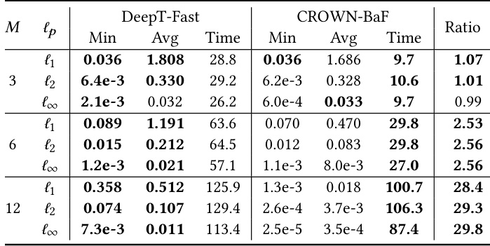  

Transformer Networks. A Transformer network gets a sentence as input and predicts the binary sentiment polarity of the sentence. Unless otherwise noted, the networks have $M\in\{3,6,12\}$ layers, an embedding size of 128 and 4 heads. The hidden layer size of the feed forward networks is 128. In Section 6.2, we provide additional experiments with wider networks. In Section 6.3 and Section 6.4 we use an embedding size of 64 and hidden layer size of 64 due to memory constraints of the baseline. Further, in Section 6.6 we provide experiments using the standard layer normalization, confirming the observation of [47] that division by the standard deviation harms certification rates.  

Dataset. Unless otherwise noted, we train the transformers from scratch on the SST dataset [51] which contains 67349, 872 and 1821 examples in the training, development and test set, respectively. Additionally experiments using the larger Yelp dataset [61] are provided in Section 6.2.  

Hardware. All our experiments ran on an Nvidia 2080 Ti GPU with 11GB of memory, except for the experiments presented in Table 4 and Table 5, which ran on an Nvidia Titan X GPU with 24GB.  

Noise Symbol Reduction. DeepT-Fast reduces the number of $\ell^{\infty}$ noise symbols at every Transformer network layer to 14000, while DeepT-Precise reduces the number of $\ell^{\infty}$ noise symbols to 10000 (Section 5.1). However, for sentences with 22 words or more, these numbers are halved to lower memory usage and improve performance. These numbers were chosen empirically in order to balance precision, speed and memory use.  

Table 2. Certified radius (min and avg), time (in seconds) and ratio of the average certified radii on the Yelp dataset.   

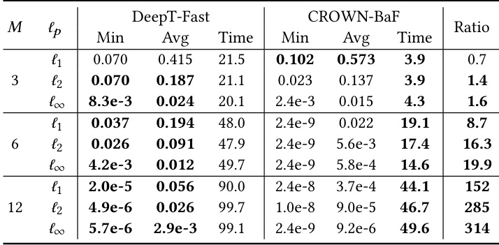  

## 6.2 Fast Verifiers: DeepT-Fast vs CROWN-BaF  

First, we compare our tool for fast verification DeepT-Fast against CROWN-BaF, the tool for fast verification in [47]. The metrics used include the size of the certified radius, the scaling behavior and the performance. To the best of our knowledge, this is the first time verification is applied on more realistically-sized Transformer networks, with 6 and 12 layers [9]; the previous maximum was 3 layers [47]. The accuracies for the 3, 6 and 12 layer networks are $83.3\%$ , $83.6\%$ and $83.4\%$ respectively on the SST dataset (Table 1) and $91.4\%$ , $91.5\%$ and $91.5\%$ respectively on the Yelp dataset (Table 2).  

As proposed in [47], we evaluate 10 correctly classified random test examples with sentence lengths not exceeding 32. Given a sentence with embeddings $E$ , for every position 𝑖we compute the maximum robustness radius $\epsilon$ around the embedding of the $i^{\mathrm{th}}$ word such that all embeddings in it are correctly classified.  

Certification Results. DeepT-Fast achieves larger certified radii than CROWN-BaF in almost every setting (Table 1, Table 2). For the deep 12-layer Transformer network, both verifiers are fast but DeepT-Fast can certify much larger perturbation regions: on average, the certified radii are $28\times$ larger on SST and $250\times$ larger on Yelp compared to those of CROWN-BaF. Thus, DeepT-Fast scales much better than CROWN-BaF: while the average certified radius decreases for DeepT-Fast by a factor of $3.5\times$ on SST and $7.5\times$ on Yelp as the number of layers increases from 3 to 12, for CROWN-BaF they decrease by a factor of $90\times$ on SST and $1553\times$ on Yelp on average.  

Performance. While CROWN-BaF is faster by a factor of 2-5 for the smallest Transformer network, the size of the performance gap shrinks to a factor of 1.25 on SST and 2 on Yelp for the 12-layer network because DeepT-Fast’s computational complexity scales linearly with the number of layers while for CROWN-BaF it increases superlinearly.  

Overall, these results indicate that DeepT-Fast is the suitable choice when the goal is to verify deeper and more practical Transformer networks.  

Table 3. Certified radius (min and avg), time (in seconds) and ratio of the average certified radii for Transformer networks with embedding size of 256 and hidden size of 512. Execution failures are indicated by “-”.  

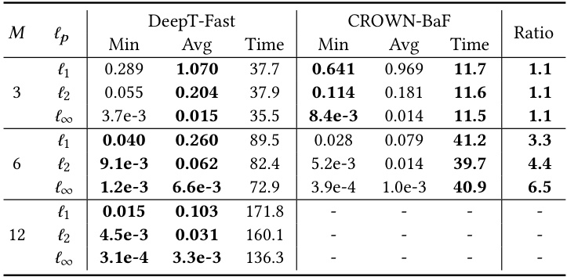  

Large Width Transformer Network Results. To evaluate the performance on wider Transformer networks, we double the embedding size to 256 and quadruple the hidden layer size to 512. We evaluated on the SST dataset, the accuracies are $83.2\%$ , $83.2\%$ and $83.0\%$ for the 3, 6 and 12 layer network respectively. The results are given in Table 3.  

Due to memory issues, CROWN-BaF failed to verify anything for the wider 12 layer Transformer network. DeepTFast, on the other hand, succeeded due to its tunable noise symbol reduction, allowing for fine-grained tradeoffs between precision and memory usage. The results are in agreement with the previous observations.  

## 6.3 The Precision-Performance Tradeof  

To compare the two variants of the dot product abstract transformer (Section 4.8), we evaluate the certification of DeepT-Precise and DeepT-Fast against $\ell^{\infty}$ attacks. Additionally, we compare DeepT-Precise with CROWN-Backward since they both operate in the regime of more precise but slower verification (Table 4). Because of the reduced speed, we only perturb a randomly chosen position per example sentence instead of evaluating perturbations for all positions. The accuracies for the 3, 6 and 12 layer networks we evaluate on are $83.5\%$ , $83.7\%$ and $83.4\%$ respectively.  

Memory Usage of CROWN-Backwards. Since CROWNBackward requires for larger sentences more memory than the 2080 Ti GPU can provide, even in the case of a moderately sized 3 layer Transformer network, we verify a smaller Transformer network where the embedding size is 64 and the hidden size 64. We run all verifiers on a 24 GB Nvidia Titan X GPU to provide a fair timing comparison since the memory requirements of CROWN-Backward for the downscaled 12 layer Transformer network still exceed the 2080 Ti.  

Results. In the trade-off between powerful certification and performance, DeepT-Fast achieves the fastest results, DeepT-Precise achieves the highest average precision while CROWN-Backward is in an intermediate position, albeit it has the best minimum certified radius. For the 12-layer Transformer network, DeepT-Fast achieves $10\%$ lower certification compared to CROWN-Backward but it is $12\mathbf{x}$ faster. Compared to DeepT-Precise, it achieves $30\%$ lower certification but it is $39\mathrm{x}$ faster. DeepT-Precise achieves better precision than DeepT-Fast despite more noise symbols being eliminated during the noise symbol reduction steps, highlighting the importance of the dot-product abstract transformer.  

Table 4. Certified radius (min and avg) and time (in seconds) for $\ell^{\infty}$ perturbations. The results for CROWN-BaF can be found in Appendix A.4.   

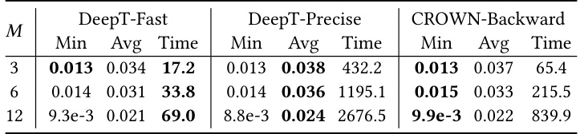  

Table 5. Certified radius (min and avg) and time (in seconds) for $\ell^{p}$ perturbations.   

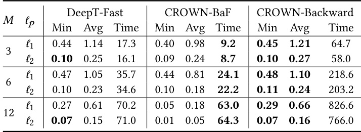  

## 6.4 Comparison for $\ell^{1}$ and $\ell^{2}$ Perturbations  

We also compare DeepT-Fast with CROWN-Backward for $\ell^{p}$ where $p\in\{1,2\}$ , as well as with CROWN-BaF (Table 5).  

Comparison with CROWN-Backward. DeepT-Fast is $3.7{\times},\,6.0{\times}$ and $11.2\times$ faster than CROWN-Backward for the 3, 6 and 12 layer Transformer networks respectively while having lower memory usage, with only a $7\%$ to $9\%$ reduction in certified radius.  

Comparison with CROWN-BaF. DeepT-Fast’s average certification radii are larger in all settings, especially for the 12 layer Transformer network where the radii are $3.3\times$ larger, but certification is $2\times$ slower. For the 6 layer Transformer network, the smallest radius computed by CROWN-BaF matches the one computed by DeepT-Fast, but DeepT-Fast provides larger radii for the 3 and 12-layer Transformer networks.  

Scalability of DeepT-Fast and CROWN-BaF. As in Section 6.3, we rely on small networks due to the comparison against CROWN-Backward. Likely due to the reduced network size, CROWN-BaF verification loses precision less quickly compared to the first set of experiments, degrading by a factor of 5.4 (instead of 90) between the 3 layer network  

Table 6. Applying the dual norm on the $\ell^{\infty}$ -norm noise symbols first for the dot product abstract transformer of DeepT-Fast leads to higher certified radii on average.  

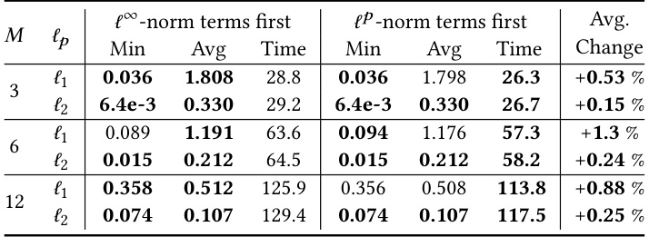  

Table 7. Certified radius (min and avg), time (in seconds) and ratio of the certified average radii for Transformers with standard layer normalization.   

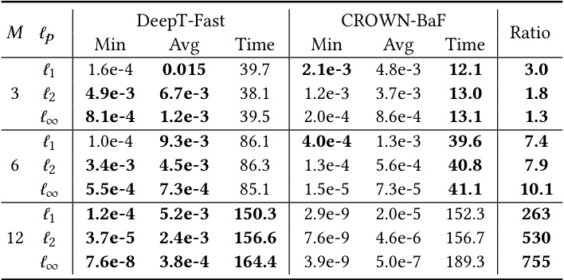  

and the 12 layer network. This still indicates that DeepT-Fast scales better compared to CROWN-BaF in width and depth.  

## 6.5 Dual Norm Order  

Since the final bound obtained by the DeepT-Fast dot product transformer is not symmetric in $W$ and $V$ (Section 4.8), we evaluated both orders (Table 6) which showed that on average it is slightly advantageous to apply the dual norm first on the $\ell^{\infty}$ -norm terms and then on the $\ell^{p}$ -norm terms.  

## 6.6 Standard Layer Normalization Results  

The certification experiments presented in this work evaluate our methods on Transformer networks without the division by the standard deviation in the layer normalization, as described in [47]. They report improved certification rates without a significant impact on performance. Our experiments (Table 7) confirm the observation of [47]. The accuracies of the Transformer networks using division are $81.9\%$ , $82.2\%$ and $81.8\%$ respectively for the 3, 6 and 12 layer Transformer networks. The accuracies are slightly lower than the accuracies of the Transformer networks without division by the standard deviation, but the latter has almost always the larger certification radii.  

Table 8. Comparison between CROWN-BaF and DeepT-Fast for robustness certification against synonym attacks on 137 sentences. The network accuracy is $81.6\%$ .   

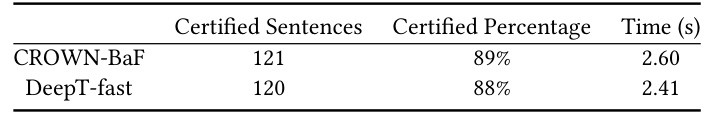  

## 6.7 Certification against Synonym Attacks  

We also evaluate our method against threat model T2, where every word in the input sequence can be replaced by one of its synonyms independently, making it significantly more difficult to certify compared to threat model T1. Note, that the threat model T2 covers also a threat model where only a fixed number of words can be replaced by synonyms as T2 is strictly stronger. We focus on sentences of up to 26 words where the number of combinations of synonyms is at least 32 000, though many considered sentences have significantly more combinations, because they pose a more difficult verification challenge as they are the ones for which enumeration-based methods are considerably slower than our certification methods.  

When comparing the certified robustness rates of DeepTFast against CROWN-BaF (Table 8), we see that the performance is comparable on a 3 layer Transformer network trained for certifiability using the method provided in [57]. The accuracy is $81.7\%$ . We note that some verified sentences have millions of combinations and testing all combinations would take at least 2 orders of magnitude more time. DeepTFast is competitive with CROWN-BaF, even though the training method is tailored to improve the verification success rate of the CROWN method and the small size of the network. The verifiers could not be evaluated on larger networks because the certified training method [57] failed for larger networks. We conjecture that DeepT-Fast would achieve superior verification compared to CROWN-BaF in the large-network setting. Table 9 details one of these certifiable sentences with 23 million possible combinations.  

## 6.8 Summary  

At a high level, our results indicate that if one is interested in pushing certification for deeper Transformer networks (as typically used in practice), then DeepT-Fast would be the preferred choice as it scales well while being significantly more precise than current state-of-the-art. If one is interested in the maximal attainable precision, then DeepT-Precise would be preferred as it is currently the most precise Transformer network verifier.  

# 7 Related Work  

Next, we discuss related work in both neural network certification and Transformer networks.  

Table 9. Example certifiable sentence with 23 million possible combinations, along with the synonyms generated by the attack in [1] for every position. Enumeration-based verification would take 2 to 3 orders of magnitude more time compared to our verification method.  

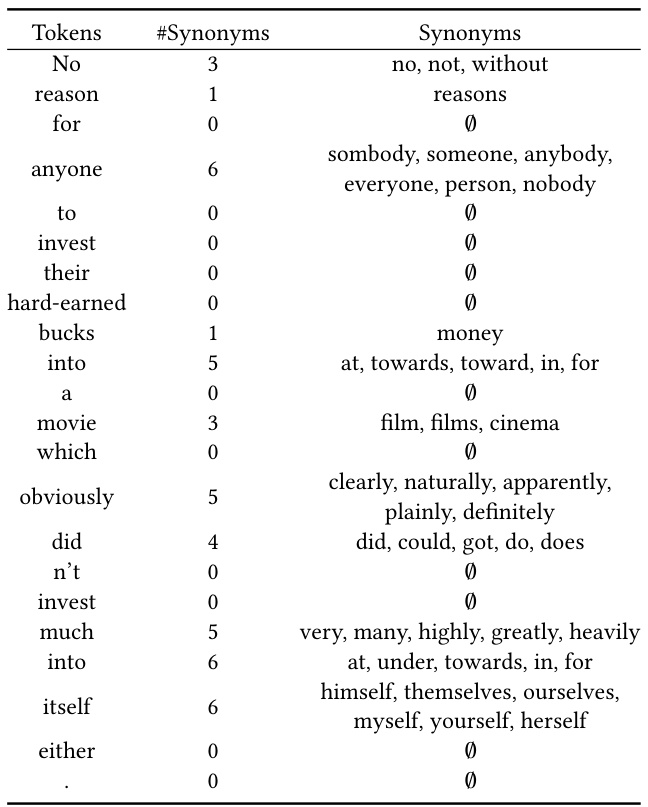  

Neural Network Certification. A wide variety of certification methods guaranteeing the local robustness of neural networks around a given input have been proposed in recent years. The certification methods can be grouped into two categories: the complete, but less scalable methods and incomplete but more scalable methods.  

Among the complete ones, some are relying on SMTsolvers [6, 12, 26] or mixed-integer linear programming [53]. Incomplete methods rely on a wide range of techniques including abstract interpretation [15, 48–50], linear relaxation [46, 55, 60] and duality [11]. While these methods provide deterministic guarantees, a recent development in the space of incomplete verification is randomized smoothing [8, 29, 30, 45], which provides probabilistic certificates. Due to their scalability advantages, as they are able to handle larger networks, we focus in this paper on incomplete verification methods with standard deterministic guarantees.  

While most work regarding neural network certification is about $\ell^{p}$ robustness, neural networks can also be certified against semantic perturbation beyond $\ell^{p}$ robustness, e.g., certification against geometric perturbations on images like rotations or translations [3, 14, 39, 42] or vector fields [44].  

Transformer Networks. Transformer networks [54] are neural networks designed to process sets or sequences, such as sentences, sound or images. The Transformer network architecture and the attention mechanisms it introduces have recently led to major advances in natural language processing [9, 27, 58]. Currently, this type of network and its refinements are the de facto standard for most natural language processing tasks, similar to convolutional networks for image processing tasks. Further, transformer networks have recently been successfully used in tasks even beyond natural language processing, including object detection [7], graph classification [32] and speech recognition [20], and have also been combined with existing architectures such as convolutional neural networks to achieve state-of-the-art results in visual question answering [33] or image synthesis [59].  

Adversarial Attacks on Transformer Networks. One of the early adversarial attacks in the space of NLP was presented by [1], where the attacker model allowed to exchange each word in the input sequence by one of 8 nearest neighbors in the embedding space. To reduce the number of false synonyms (words whose embeddings are close but are not synonyms in the context of the sentence), a simple language model was used and empirically validated. Later, [22] successfully attacked Transformer networks by replacing one word in the input sequence with a synonym, and observed that transformer networks tend to be more robust than LSTMs. A gradient-ascent based attack was presented in [5] which uses a FGSM-like attack on the embeddings, after which each word in the sequence gets replaced by the word having the embedding closest to the attacked embedding for that word. [23, 31, 34] present attacks tailored to perturb few words, with the key idea being to only consider perturbing words that are important for classification.  

Transformer Network Certification. While neural network certification has been successfully applied to feedforward and convolutional networks classifying images, the certification of Transformer networks has been considered only very recently. A first inclination might be to certify these networks against synonym-based attacks by enumerating all possibilities. This however works only for short sequences of words where additionally each has only a few synonyms. As discussed already, [47] certifies robustness against $\ell^{p}$ -norm bound changes in the embedding space for $p\;\in\;\{1,2,\infty\}$ . The idea here is to certify against changes in the embedding space, as this should cover synonyms if the certified radius is large enough. Further, [57] certifies against synonym attacks for small 1-layer transformer networks, where a small subset of words can be replaced by synonyms. Here, the attacker model is similar to [1], with the restriction that just a few words can be changed. Recently, [62] used the certified training method presented in [37] to train Transformer network models to be robust against NLP attacks performing deletions, insertions and reordering of words or letters.  

While training a network to be empirically more robust is orthogonal to the robustness certification task addressed in this paper, we evaluated whether our Multi-norm Zonotopes could be substituted in the training procedure presented in [62]. Our experiments showed that direct substitution is not feasible due to large memory requirements of [37] when combined with the Multi-norm Zonotope domain. However, we believe this issue could be solved by applying the COLT training method [4], which has more favorable memory characteristics. We leave this for future work.  

# 8 Conclusion  

We introduced the Multi-norm Zonotope domain, a generalization of the classical Zonotope designed to model $\ell^{p}$ perturbations by adding additional noise symbols bound by a $\ell^{p}$ -norm constraint. We carefully construct a set of abstract transformers for all operations of the Transformer network in a manner that balances scalability and precision, including the challenging softmax and dot product functions (the critical operations in self-attention) which require handling non-linearities applied to multiple terms under perturbation.  

Using our new Multi-norm Zonotope domain and its abstract transformers, we built DeepT, the first verifier able to certify more realistically-sized Transformer networks with high precision and fast performance. We evaluated the effectiveness, performance and scalability of DeepT for certifying Transformer networks for binary classification against $\ell^{p}$ attacks. Our results show that DeepT achieves fast and effective certification of Transformer networks, even for deep 12-layer networks. Our method scales well, both in terms of the number of layers and in terms of the size of the input embeddings, contrarily to state-of-the-art which either becomes impractically slow or whose certification strength reduces dramatically for deeper networks.  

We also demonstrate, for the first time, successful certification for Transformer networks against synonym attacks for long word sequences having many synonyms, where each word can potentially be replaced by many substitutes. Our DeepT verifier achieves an $84\%$ success rate when verifying a certifiably-pretrained Transformer network for sentences where enumeration-based methods would take 2 to 3 orders of magnitude more time.  

# References  

[1] Moustafa Alzantot, Yash Sharma, Ahmed Elgohary, Bo-Jhang Ho, Mani B. Srivastava, and Kai-Wei Chang. 2018. Generating Natural Language Adversarial Examples. In EMNLP. Association for Computational Linguistics, 2890–2896. https://doi.org/10.18653/v1/d18-1316   
[2] Lei Jimmy Ba, Jamie Ryan Kiros, and Geoffrey E. Hinton. 2016. Layer Normalization. CoRR abs/1607.06450 (2016).   
[3] Mislav Balunovic, Maximilian Baader, Gagandeep Singh, Timon Gehr, and Martin T. Vechev. 2019. Certifying Geometric Robustness of Neural Networks. In NeurIPS. 15287–15297.   
[4] Mislav Balunovic and Martin Vechev. 2020. Adversarial Training and Provable Defenses: Bridging the Gap. In International Conference on Learning Representations. https://openreview.net/forum?id= SJxSDxrKDr   
[5] Melika Behjati, Seyed-Mohsen Moosavi-Dezfooli, Mahdieh Soleymani Baghshah, and Pascal Frossard. 2019. Universal Adversarial Attacks on Text Classifiers. In ICASSP. IEEE, 7345–7349. https://doi.org/10. 1109/ICASSP.2019.8682430   
[6] Rudy Bunel, Ilker Turkaslan, Philip H. S. Torr, Pushmeet Kohli, and Pawan Kumar Mudigonda. 2018. A Unified View of Piecewise Linear Neural Network Verification. In NeurIPS. 4795–4804.   
[7] Nicolas Carion, Francisco Massa, Gabriel Synnaeve, Nicolas Usunier, Alexander Kirillov, and Sergey Zagoruyko. 2020. End-to-End Object Detection with Transformers. In ECCV (1) (Lecture Notes in Computer Science, Vol. 12346). Springer, 213–229. https://doi.org/10.1007/978-3- 030-58452-8_13   
[8] Jeremy M. Cohen, Elan Rosenfeld, and J. Zico Kolter. 2019. Certified Adversarial Robustness via Randomized Smoothing. In ICML (Proceedings of Machine Learning Research, Vol. 97). PMLR, 1310–1320.   
[9] Jacob Devlin, Ming-Wei Chang, Kenton Lee, and Kristina Toutanova. 2019. BERT: Pre-training of Deep Bidirectional Transformers for Language Understanding. In NAACL-HLT (1). Association for Computational Linguistics, 4171–4186. https://doi.org/10.18653/v1/n19-1423   
[10] Alexey Dosovitskiy, Lucas Beyer, Alexander Kolesnikov, Dirk Weissenborn, Xiaohua Zhai, Thomas Unterthiner, Mostafa Dehghani, Matthias Minderer, Georg Heigold, Sylvain Gelly, Jakob Uszkoreit, and Neil Houlsby. 2020. An Image is Worth 16x16 Words: Transformers for Image Recognition at Scale. CoRR abs/2010.11929 (2020).   
[11] Krishnamurthy Dvijotham, Robert Stanforth, Sven Gowal, Timothy A. Mann, and Pushmeet Kohli. 2018. A Dual Approach to Scalable Verification of Deep Networks. In UAI. AUAI Press, 550–559.   
[12] Rüdiger Ehlers. 2017. Formal Verification of Piece-Wise Linear FeedForward Neural Networks. In ATVA (Lecture Notes in Computer Science, Vol. 10482). Springer, 269–286. https://doi.org/10.1007/978-3-319- 68167-2_19   
[13] Logan Engstrom, Brandon Tran, Dimitris Tsipras, Ludwig Schmidt, and Aleksander Madry. 2019. Exploring the Landscape of Spatial Robustness. In ICML (Proceedings of Machine Learning Research, Vol. 97). PMLR, 1802–1811.   
[14] Marc Fischer, Maximilian Baader, and Martin Vechev. 2020. Certified Defense to Image Transformations via Randomized Smoothing. NeurIPS 33.   
[15] Timon Gehr, Matthew Mirman, Dana Drachsler-Cohen, Petar Tsankov, Swarat Chaudhuri, and Martin T. Vechev. 2018. AI2: Safety and Robustness Certification of Neural Networks with Abstract Interpretation. In IEEE Symposium on Security and Privacy. IEEE Computer Society, 3–18. https://doi.org/10.1109/SP.2018.00058   
[16] Khalil Ghorbal, Eric Goubault, and Sylvie Putot. 2009. The Zonotope Abstract Domain Taylor1 $^+$ . In CAV (Lecture Notes in Computer Science, Vol. 5643). Springer, 627–633. https://doi.org/10.1007/978-3-642-02658- 4_47   
[17] Khalil Ghorbal, Eric Goubault, and Sylvie Putot. 2010. A Logical Product Approach to Zonotope Intersection. In CAV (Lecture Notes in Computer Science, Vol. 6174). Springer, 212–226. https://doi.org/10. 1007/978-3-642-14295-6_22   
[18] Ian J. Goodfellow, Jonathon Shlens, and Christian Szegedy. 2015. Explaining and Harnessing Adversarial Examples. In ICLR (Poster).   
[19] Eric Goubault and Sylvie Putot. 2006. Static Analysis of Numerical Algorithms. In SAS (Lecture Notes in Computer Science, Vol. 4134). Springer, 18–34. https://doi.org/10.1007/11823230_3   
[20] Anmol Gulati, James Qin, Chung-Cheng Chiu, Niki Parmar, Yu Zhang, Jiahui Yu, Wei Han, Shibo Wang, Zhengdong Zhang, Yonghui Wu, and Ruoming Pang. 2020. Conformer: Convolution-augmented Transformer for Speech Recognition. In INTERSPEECH. ISCA, 5036–5040. https://doi.org/10.21437/Interspeech.2020-3015   
[21] Kaiming He, Xiangyu Zhang, Shaoqing Ren, and Jian Sun. 2016. Deep Residual Learning for Image Recognition. In CVPR. IEEE Computer Society, 770–778. https://doi.org/10.1109/CVPR.2016.90   
[22] Yu-Lun Hsieh, Minhao Cheng, Da-Cheng Juan, Wei Wei, Wen-Lian Hsu, and Cho-Jui Hsieh. 2019. On the Robustness of Self-Attentive Models. In ACL (1). Association for Computational Linguistics, 1520– 1529. https://doi.org/10.18653/v1/p19-1147   
[23] Di Jin, Zhijing Jin, Joey Tianyi Zhou, and Peter Szolovits. 2020. Is BERT Really Robust? A Strong Baseline for Natural Language Attack on Text Classification and Entailment. In AAAI. AAAI Press, 8018–8025.   
[24] Matt Jordan, Justin Lewis, and Alexandros G. Dimakis. 2019. Provable Certificates for Adversarial Examples: Fitting a Ball in the Union of Polytopes. In NeurIPS. 14059–14069.   
[25] Can Kanbak, Seyed-Mohsen Moosavi-Dezfooli, and Pascal Frossard. 2018. Geometric Robustness of Deep Networks: Analysis and Improvement. In CVPR. IEEE Computer Society, 4441–4449. https: //doi.org/10.1109/CVPR.2018.00467   
[26] Guy Katz, Clark W. Barrett, David L. Dill, Kyle Julian, and Mykel J. Kochenderfer. 2017. Reluplex: An Efficient SMT Solver for Verifying Deep Neural Networks. In CAV (1) (Lecture Notes in Computer Science, Vol. 10426). Springer, 97–117. https://doi.org/10.1007/978-3-319-63387- 9_5   
[27] Zhenzhong Lan, Mingda Chen, Sebastian Goodman, Kevin Gimpel, Piyush Sharma, and Radu Soricut. 2020. ALBERT: A Lite BERT for Self-supervised Learning of Language Representations. In ICLR. OpenReview.net.   
[28] Yann LeCun, Léon Bottou, Yoshua Bengio, and Patrick Haffner. 1998. Gradient-based learning applied to document recognition. Proc. IEEE 86, 11 (1998), 2278–2324.   
[29] Mathias Lécuyer, Vaggelis Atlidakis, Roxana Geambasu, Daniel Hsu, and Suman Jana. 2019. Certified Robustness to Adversarial Examples with Differential Privacy. In IEEE Symposium on Security and Privacy. IEEE, 656–672. https://doi.org/10.1109/SP.2019.00044   
[30] Bai Li, Changyou Chen, Wenlin Wang, and Lawrence Carin. 2018. Second-Order Adversarial Attack and Certifiable Robustness. CoRR abs/1809.03113 (2018).   
[31] Jinfeng Li, Shouling Ji, Tianyu Du, Bo Li, and Ting Wang. 2019. TextBugger: Generating Adversarial Text Against Real-world Applications. In NDSS. The Internet Society.   
[32] Jia Li, Yu Rong, Hong Cheng, Helen Meng, Wen-bing Huang, and Junzhou Huang. 2019. Semi-Supervised Graph Classification: A Hierarchical Graph Perspective. In WWW. ACM, 972–982. https: //doi.org/10.1145/3308558.3313461   
[33] Liunian Harold Li, Mark Yatskar, Da Yin, Cho-Jui Hsieh, and Kai-Wei Chang. 2019. VisualBERT: A Simple and Performant Baseline for Vision and Language. CoRR abs/1908.03557 (2019).   
[34] Bin Liang, Hongcheng Li, Miaoqiang Su, Pan Bian, Xirong Li, and Wenchang Shi. 2018. Deep Text Classification Can be Fooled. In IJCAI. ijcai.org, 4208–4215. https://doi.org/10.24963/ijcai.2018/585   
[35] Ze Liu, Yutong Lin, Yue Cao, Han Hu, Yixuan Wei, Zheng Zhang, Stephen Lin, and Baining Guo. 2021. Swin Transformer: Hierarchical Vision Transformer using Shifted Windows. arXiv:2103.14030 [cs.CV]   
[36] Aleksander Madry, Aleksandar Makelov, Ludwig Schmidt, Dimitris Tsipras, and Adrian Vladu. 2018. Towards Deep Learning Models Resistant to Adversarial Attacks. In ICLR (Poster). OpenReview.net.   
[37] Matthew Mirman, Timon Gehr, and Martin T. Vechev. 2018. Differentiable Abstract Interpretation for Provably Robust Neural Networks. In ICML (Proceedings of Machine Learning Research, Vol. 80). PMLR, 3575–3583.   
[38] Matthew Mirman, Gagandeep Singh, and Martin T. Vechev. 2019. A Provable Defense for Deep Residual Networks. CoRR abs/1903.12519 (2019). http://arxiv.org/abs/1903.12519   
[39] Jeet Mohapatra, Tsui-Wei Weng, Pin-Yu Chen, Sijia Liu, and Luca Daniel. 2020. Towards Verifying Robustness of Neural Networks Against A Family of Semantic Perturbations. In CVPR. IEEE, 241–249. https://doi.org/10.1109/CVPR42600.2020.00032   
[40] Nikola Mrksic, Diarmuid Ó Séaghdha, Blaise Thomson, Milica Gasic, Lina Maria Rojas-Barahona, Pei-Hao Su, David Vandyke, Tsung-Hsien Wen, and Steve J. Young. 2016. Counter-fitting Word Vectors to Linguistic Constraints. In HLT-NAACL. The Association for Computational Linguistics, 142–148. https://doi.org/10.18653/v1/n16-1018   
[41] Mark Niklas Mueller, Mislav Balunovic, and Martin Vechev. 2021. Boosting Certified Robustness of Deep Networks via a Compositional Architecture. In International Conference on Learning Representations.   
[42] Kexin Pei, Yinzhi Cao, Junfeng Yang, and Suman Jana. 2017. Towards Practical Verification of Machine Learning: The Case of Computer Vision Systems. CoRR abs/1712.01785 (2017).   
[43] W. Rudin. 1991. Functional Analysis (second ed.). McGraw-Hill, 92–95.   
[44] Anian Ruoss, Maximilian Baader, Mislav Balunovic, and Martin T. Vechev. 2020. Efficient Certification of Spatial Robustness. CoRR abs/2009.09318 (2020).   
[45] Hadi Salman, Jerry Li, Ilya P. Razenshteyn, Pengchuan Zhang, Huan Zhang, Sébastien Bubeck, and Greg Yang. 2019. Provably Robust Deep Learning via Adversarially Trained Smoothed Classifiers. In NeurIPS. 11289–11300.   
[46] Hadi Salman, Greg Yang, Huan Zhang, Cho-Jui Hsieh, and Pengchuan Zhang. 2019. A Convex Relaxation Barrier to Tight Robustness Verification of Neural Networks. In NeurIPS. 9832–9842.   
[47] Zhouxing Shi, Huan Zhang, Kai-Wei Chang, Minlie Huang, and ChoJui Hsieh. 2020. Robustness Verification for Transformers. In ICLR. OpenReview.net.   
[48] Gagandeep Singh, Rupanshu Ganvir, Markus Püschel, and Martin T. Vechev. 2019. Beyond the Single Neuron Convex Barrier for Neural Network Certification. In NeurIPS. 15072–15083.   
[49] Gagandeep Singh, Timon Gehr, Matthew Mirman, Markus Püschel, and Martin T. Vechev. 2018. Fast and Effective Robustness Certification. In NeurIPS. 10825–10836.   
[50] Gagandeep Singh, Timon Gehr, Markus Püschel, and Martin T. Vechev. 2019. An abstract domain for certifying neural networks. Proc. ACM Program. Lang. 3, POPL (2019), 41:1–41:30. https://doi.org/10.1145/ 3290354   
[51] Richard Socher, Alex Perelygin, Jean Wu, Jason Chuang, Christopher D. Manning, Andrew Y. Ng, and Christopher Potts. 2013. Recursive Deep Models for Semantic Compositionality Over a Sentiment Treebank. In EMNLP. ACL, 1631–1642.   
[52] Christian Szegedy, Wojciech Zaremba, Ilya Sutskever, Joan Bruna, Dumitru Erhan, Ian J. Goodfellow, and Rob Fergus. 2014. Intriguing properties of neural networks. In ICLR (Poster).   
[53] Vincent Tjeng, Kai Y. Xiao, and Russ Tedrake. 2019. Evaluating Robustness of Neural Networks with Mixed Integer Programming. In ICLR (Poster). OpenReview.net.   
[54] Ashish Vaswani, Noam Shazeer, Niki Parmar, Jakob Uszkoreit, Llion Jones, Aidan N. Gomez, Lukasz Kaiser, and Illia Polosukhin. 2017. Attention is All you Need. In NIPS. 5998–6008.   
[55] Tsui-Wei Weng, Huan Zhang, Hongge Chen, Zhao Song, Cho-Jui Hsieh, Luca Daniel, Duane S. Boning, and Inderjit S. Dhillon. 2018. Towards Fast Computation of Certified Robustness for ReLU Networks. In ICML (Proceedings of Machine Learning Research, Vol. 80). PMLR, 5273–5282.   
[56] Eric Wong and J. Zico Kolter. 2018. Provable Defenses against Adversarial Examples via the Convex Outer Adversarial Polytope. In ICML (Proceedings of Machine Learning Research, Vol. 80). PMLR, 5283–5292.   
[57] Kaidi Xu, Zhouxing Shi, Huan Zhang, Minlie Huang, Kai-Wei Chang, Bhavya Kailkhura, Xue Lin, and Cho-Jui Hsieh. 2020. Automatic Perturbation Analysis on General Computational Graphs. CoRR abs/2002.12920 (2020).   
[58] Zhilin Yang, Zihang Dai, Yiming Yang, Jaime G. Carbonell, Ruslan Salakhutdinov, and Quoc V. Le. 2019. XLNet: Generalized Autoregressive Pretraining for Language Understanding. In NeurIPS. 5754–5764.   
[59] Han Zhang, Ian J. Goodfellow, Dimitris N. Metaxas, and Augustus Odena. 2019. Self-Attention Generative Adversarial Networks. In ICML (Proceedings of Machine Learning Research, Vol. 97). PMLR, 7354–7363.   
[60] Huan Zhang, Tsui-Wei Weng, Pin-Yu Chen, Cho-Jui Hsieh, and Luca Daniel. 2018. Efficient Neural Network Robustness Certification with General Activation Functions. In NeurIPS. 4944–4953.   
[61] Xiang Zhang, Junbo Zhao, and Yann LeCun. 2015. Character-Level Convolutional Networks for Text Classification . arXiv:1509.01626 [cs] (Sept. 2015). arXiv:1509.01626 [cs]   
[62] Yuhao Zhang, Aws Albarghouthi, and Loris D’Antoni. 2020. Robustness to Programmable String Transformations via Augmented Abstract Training. In ICML (Proceedings of Machine Learning Research, Vol. 119). PMLR, 11023–11032.  

# A Appendix  

# A.1 Solving the Minimization Problem  

We describe the method from [17] to solve the minimization problem below with $O((\mathcal{E}_{p}+\mathcal{E}_{\infty})\log(\mathcal{E}_{p}+\mathcal{E}_{\infty}))$ complexity:  

$$
v^{*}=\text{min}_{v}S=\text{min}_{v}\left[\sum_{i=1}^{\mathcal{E}_{p}}|\alpha_{z}^{i}|+\sum_{j=1}^{\mathcal{E}_{\infty}}|\beta_{z}^{j}|\right].
$$  

[17] relies on two observations. First, since all coefficients in the minimization can be written in form $r+s\beta_{z}^{k}$ with $r,s\in\mathbb{R}$ (see Eqs. 5-6), the expression to be minimized is of the form $\begin{array}{r}{S=\sum_{t}|r_{t}+s_{t}\beta_{z}^{k}|}\end{array}$ . The optimal value $v^{*}$ for $\beta_{z}^{k}$ will cause one of the $|r_{t}+s_{t}\beta_{z}^{k}|$ terms to be 0 and therefore $v^{\ast}$ must equal $\frac{-r_{i}}{s_{i}}$ for some $i\;\in\;[1,\mathcal{E}_{p}+\mathcal{E}_{\infty}]$ . The values $\frac{-r_{i}}{s_{i}}$ are the candidate solutions for the minimization problem and simply testing them all would lead to an algorithm with complexity $O((\mathcal{E}_{p}+\mathcal{E}_{\infty})^{2})$ .  

To improve on this, a second observation is used: each term $|r_{t}+s_{t}\beta_{z}^{k}|$ of $S$ has a constant negative slope before $\frac{-r_{t}}{s_{t}}$ and a constant positive slope after it. Therefore, as $\beta_{z}^{k}$ increases the slope of more and more $|r_{t}+s_{t}\beta_{z}^{k}|$ terms becomes positive, showing that the slope of $S$ increases monotonically with $\beta_{z}^{k}$ . The minimum value of 𝑆will happen at the value of $\beta_{z}^{k}$ where the slope of $S$ changes from negative to positive. Since the slope of $S$ increases monotonically, we can run a binary search on $\beta_{z}^{k}$ to efficiently find the value at which the slope of $S$ changes sign, obtaining an algorithm with $O((\mathcal{E}_{p}+\mathcal{E}_{\infty})\log(\mathcal{E}_{p}+\mathcal{E}_{\infty}))$ complexity. To maintain precision, we exclude the candidate solutions that lead to the elimination of one of the $\ell^{p}$ -norm noise symbols $\phi$ . This requires an additional linear search but doesn’t change the overall complexity of the algorithm.  

# A.2 Comparison with GeoCert for $\ell_{p}$ Perturbations  

While this paper focuses on using Multi-norm Zonotopes for Transformer networks verification, the domain is general and can be applied to other architectures. We illustrate this by certifying a small fully-connected DNN for MNIST [28] and compared it to GeoCert method [24] on $\ell_{2}$ perturbations. The DNN performs binary classification on MNIST [28] images with digits 1 or 7, and is composed of a feed-forward network with ReLU nonlinearities and hidden sizes of 10, 50 and 10.  

Without any adaptation of our method, we evaluate certification using Multi-norm Zonotopes and compare it to GeoCert (Table 10). While the radii are significantly smaller, the certification is significantly faster. We believe the results indicate a promising future work item.  

# A.3 Certifying Visual Transformers for Image Classification  

While originally developed for NLP, Transformer networks have been successfully applied in computer vision tasks, such as image classification [10] and object detection [7, 35],  

Table 10. Certified radius (min and avg) and time (in seconds) of Multi-norm Zonotope based certification (DeepT) and GeoCert [24] for perturbations of norm $p=2$ .  

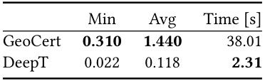  

Table 11. Certified radius (min and avg) and time (in seconds) of DeepT-Fast for a Vision Transformers and perturbations of norm $p\in\{1,2,\infty\}$ .   

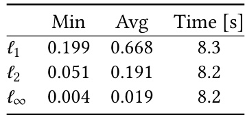  

achieving competitive [7, 10] or state-of-the-art performance [35].  

To evaluate the certification capabilities of DeepT in domains other than NLP, we focus on robustness certification of image classification models. More specifically, our goal will be to prove that a Vision Transformer network [10] will correctly classify images even if they have suffered a $\ell^{p}$ perturbation, a common threat model in computer vision.  

Model and Dataset. The Vision Transformer network has 1 encoding layer, an embedding size of 64 and the size of the hidden layer of the feed-forward network is 128. The selfattention layer has 4 attention heads. The input image is split into patches of size $7\mathrm{{x}7}$ , each being mapped through a linear layer to an embedding of size 64 after which a positional encoding is added. We evaluate on 100 randomly selected images of the MNIST dataset [28]. The network achieves $95.54\%$ test accuracy.  

Results. We report the size of certified radius and the performance of DeepT when certifying against $\ell^{1}$ , $\ell^{2}$ and $\ell^{\infty}$ perturbations in Table 11.  

# A.4 Complete Results for the Precision-Performance Tradeoff  

Table 12 contains the full results for the experiment of Section 6.3 which additionally contains the results for the CROWNBaF verifier. DeepT-Fast achieves larger average certified radii than CROWN-BaF in all settings, with the certification gap increasing substantially for deeper networks, but is 1.5- 4.4 times slower, with the performance gap reducing for deeper networks.  

# A.5 Evaluating the Softmax Sum Refinement  

We perform an ablation study to evaluate the effect of the Zonotope refinement using the softmax sum constraint. We compare the DeepT-Fast verifier with and without the refinement. We observe that the refinement leads to the certification radii improvements that increases with the depth on the neural network (Table 13). The improvement is small ( $0.04\%$ - $0.49\%$ ) for the 3 layer Transformer networks but increases to $2.62\%{-3.21\%}$ for the 12 layer Transformer networks, at a $5\mathrm{-9\%}$ performance cost.  

Table 12. Certified radius (min and avg) and time (in seconds) for DeepT-Fast, CROWN-BaF, DeepT-Precise and CROWNBackward for $\ell^{\infty}$ perturbations.   

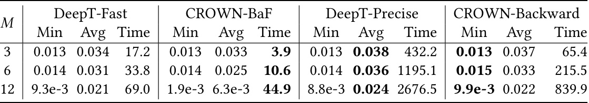  

Table 13. Refining the Zonotope by using the softmax sum constraint in the DeepT-Fast verifier leads to higher certified radius. The results are rounded, but the improvement is computed using the full precision floating point numbers. Experiments ran on a $1080\ \mathrm{Ti}$ with 11GB of RAM.   

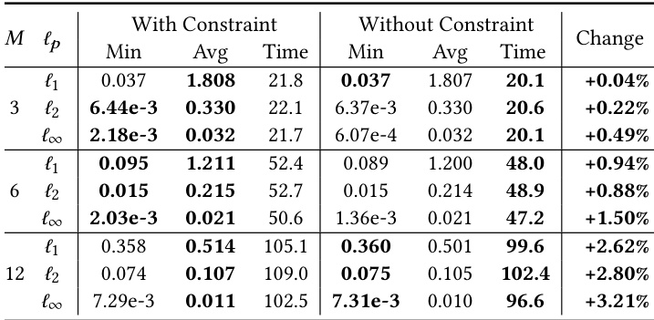  

Table 14. Certified radius (min and avg) and time (in seconds) for the DeepT verifier that combines DeepT-Precise and DeepT-Fast, and CROWN-Backward for $\ell^{\infty}$ perturbations.   

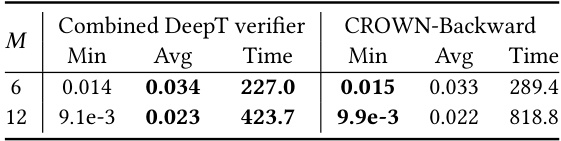  

# A.6 Combining DeepT-Fast and DeepT-Precise  

By using the more precise abstract transformer for the dot product only in the last layer of the Transformer network and the faster version in the remaining layers, we obtain a verifier that is both faster and more precise on average than CROWNBackward for the 6 and 12 layer Transformer networks (Table 14). For these networks, reduction to 5000 and 7000 noise symbols is applied in the last layer, and reduction to 14000 and 20000 noise symbols in the remaining layers.  